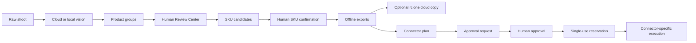

<div align="center">


# CatalogMesh

### AI workspace for product catalog operations — grouping, review, SKU matching, exports, storage and guarded automation.

GUI + CLI parity · Cloud & local vision · Human review · rclone storage · Shopify / Akeneo / Odoo workflows · MCP-safe automation

[](https://github.com/mhmdwaelanwr/ai-product-photo-sorter/actions/workflows/tests.yml)
[](https://www.python.org/)
[](https://github.com/mhmdwaelanwr/ai-product-photo-sorter/releases/latest)
[](https://pypi.org/project/ai-product-photo-sorter/)
[](LICENSE)

</div>


> **Release status:** the public stable package is still `v3.2.0`. `main` contains unreleased v3.3 work. The v3.3 desktop display brand is **CatalogMesh**, while the existing `ai-product-photo-sorter` package name, `product-sorter-*` CLI commands and `PRODUCT_SORTER_*` settings remain compatible through the v3.x line.

CatalogMesh turns a raw chronological product shoot into reviewed product groups, catalog/SKU matches, exports, cloud-storage copies and controlled connector actions. The original photos stay untouched. Human review remains the authority for catalog identity and externally visible publication.

## What is included

| Area | Capabilities |
|---|---|
| **Sorting engine** | Multi-angle product grouping, crash-safe SQLite resume, progress/ETA and reports. |
| **Cloud AI** | Gemini, OpenAI and Anthropic provider pools with model discovery and key rotation. |
| **Local AI** | Ollama local vision, local-only and local-first/cloud-fallback workflows. |
| **Local evidence** | Embeddings Shadow Mode, OCR, barcode evidence, calibration and Hybrid Routing Lab. |
| **Review Center** | Non-destructive merge/split/move, corrections, approval state and audit history. |
| **SKU matching** | Ranked deterministic catalog candidates with mandatory human confirmation. |
| **Exports** | Safe offline Shopify draft and neutral PIM export profiles. |
| **Storage Center** | Local-first rclone copy/dry-run/manual mirror to configured cloud remotes, with safe automatic post-run copy. |
| **Automation Center** | Desktop GUI generated from the same automation CLI parser, so command parity is tested automatically. |
| **Connectors** | Approval-aware Shopify, Akeneo and Odoo execution with connector-specific safety boundaries. |
| **Internationalization** | English, Arabic and Chinese catalogs with a final GUI translation pass; Arabic Tk shaping/BiDi is handled where native rendering is incomplete. |
| **MCP** | Safe scan/audit/proposal tools only; no generic remote-mutation, storage-transfer or publish executor is exposed. |
| **CI / delivery** | Tests, CodeQL, safety workflows, cross-platform packages and packaged Windows GUI smoke screenshots. |

## GUI and CLI parity

The normal sorter GUI and CLI share the same processing engine. The desktop **Automation Center** is additionally generated from `automation_cli.build_parser()`, which means every `product-sorter-automation` subcommand receives a corresponding GUI form automatically.

The GUI does **not** duplicate or weaken remote execution logic. Shopify, Akeneo and Odoo actions still call the same approval-aware connector functions as the CLI. Remote mutation commands require the existing approval + single-use reservation artifacts and an additional GUI confirmation phrase.

```text
CLI command added
      ↓
automation_cli.build_parser()
      ↓
CLI parser + Automation Center form
      ↓
shared connector / safety implementation
```

A CI test compares the complete GUI command catalog with the canonical CLI subcommand set so future command drift fails the test suite.

## Installation

Requires Python 3.10+.

```bash
python -m pip install --upgrade ai-product-photo-sorter
```

Main entry points (the existing `product-sorter-*` names remain compatible; v3.3 also provides CatalogMesh aliases):

```text
catalogmesh / product-sorter                         normal sorter CLI
catalogmesh-gui / product-sorter-gui                 desktop GUI
catalogmesh-setup / product-sorter-setup             guided setup
catalogmesh-automation / product-sorter-automation   catalog / connector / storage CLI
catalogmesh-watch / product-sorter-watch             watched-folder daemon
catalogmesh-mcp / product-sorter-mcp                 optional MCP server
```

Optional local and MCP extras:

```bash
python -m pip install "ai-product-photo-sorter[local-embeddings]"
python -m pip install "ai-product-photo-sorter[local-evidence]"
python -m pip install "ai-product-photo-sorter[mcp]"
```

### Stable desktop downloads

The stable `v3.2.0` release provides ready-to-run packages from the latest GitHub Release. These artifacts keep their existing v3.2 names:

| Platform | Stable artifact |
|---|---|
| Windows x64 | `ProductSorterPro-windows-x64.zip` |
| Linux Debian/Ubuntu | `product-sorter-pro_3.2.0_all.deb` |
| Linux standalone | `ProductSorterPro-linux-x64.tar.gz` |
| macOS Apple Silicon | `ProductSorterPro-macos-arm64.zip` |
| macOS Intel | `ProductSorterPro-macos-x64.zip` |

## Test the unreleased source build

To try the newest code from `main` before a public v3.3 release, use a virtual environment and install the repository in editable mode.

```bash
git clone https://github.com/mhmdwaelanwr/ai-product-photo-sorter.git
cd ai-product-photo-sorter
git checkout main
git pull --ff-only
python -m venv .venv
```

Activate the environment, then install and run the desktop app.

```bash
# Linux / macOS
source .venv/bin/activate
python -m pip install --upgrade pip
python -m pip install -e .
product-sorter-gui
```

```powershell
# Windows PowerShell
.\.venv\Scripts\Activate.ps1
python -m pip install --upgrade pip
python -m pip install -e .
product-sorter-gui
```

Useful smoke checks before using real product data:

```bash
product-sorter-automation --help
product-sorter-automation scan ./your-test-photo-folder
python -m unittest discover -s tests -t . -v
python -m compileall -q src product_sorter.py product_sorter_gui.py set_data.py scripts
```

To test the current CatalogMesh / Storage / i18n branch before it reaches `main`:

```bash
git fetch origin feat/v3.3-catalogmesh-storage-i18n
git checkout feat/v3.3-catalogmesh-storage-i18n
git pull --ff-only
```

Do not use production Shopify/Akeneo/Odoo credentials while casually testing the GUI. Local scan, review, SKU matching, offline exports, Storage dry-runs and command previews are enough to validate most of the workflow without external catalog mutation.

## Main workflow



Sorting, review and automation never treat an AI guess as confirmed catalog identity.

## Storage Center · rclone

The v3.3 source build can copy completed local output to any remote already configured in the user's rclone installation. Processing itself remains local so SQLite resume/checkpoint and temporary files are not placed directly on a cloud filesystem.

The Storage workspace includes remote discovery, connectivity testing, dry-run preview, Copy, manually confirmed Sync mirror, bandwidth limiting, transfer/checker controls, live activity and cancellation. Automatic post-run upload is deliberately **Copy-only** and never uses Sync, so it does not delete destination-only files.

CatalogMesh does not parse or own the rclone credential file and does not start the rclone remote-control HTTP server. Storage actions are not exposed through MCP.

The same functional storage surface is available from the automation CLI:

```bash
catalogmesh-automation storage-version
catalogmesh-automation storage-remotes
catalogmesh-automation storage-test gdrive: --remote-path CatalogMesh
catalogmesh-automation storage-dry-run ./Sorted_Products gdrive: --remote-path CatalogMesh
catalogmesh-automation storage-copy ./Sorted_Products gdrive: --remote-path CatalogMesh
catalogmesh-automation storage-sync ./Sorted_Products gdrive: --remote-path CatalogMesh --confirm-sync
```

`storage-sync` deliberately requires `--confirm-sync`. CLI transfer output streams through the same rclone backend used by the GUI; terminal interruption provides cancellation while the GUI exposes a Cancel button.

See [Storage Center / rclone](docs/STORAGE_RCLONE.md) for the detailed safety model and settings.

## Internationalization

The desktop UI supports English, Arabic and Chinese. v3.3 adds a final runtime translation index built from every loaded GUI catalog, so legacy labels, notebook tabs, tree headings, known status strings and dialogs are translated even when an older feature initially created them with English text.

Arabic still receives the Tk shaping/BiDi compatibility pass on platforms where native Tk rendering is incomplete. Mixed Latin tokens such as `SKU`, `AI`, `Markdown`, model names and format placeholders are preserved.

Unknown technical exception details are intentionally not machine-translated at runtime; the surrounding title/status UI is localized while the original diagnostic text is preserved for accuracy.

## Automation CLI / Automation Center

Current automation commands are defined once in `src/ai_product_photo_sorter/automation_cli.py` and are exposed by both the terminal entry point and the desktop Automation Center.

Examples:

```bash
product-sorter-automation scan ./shoot
product-sorter-automation missing-assets ./catalog.xlsx
product-sorter-automation missing-local ./catalog.xlsx ./shoot
product-sorter-automation propose-matches approved_groups.csv catalog.xlsx --top-k 5
product-sorter-automation open-review-queue review_manifest.json
product-sorter-automation prepare-shopify-draft sku_match_manifest.json
product-sorter-automation prepare-connector-plan export_manifest.json profile.json
```

Approval lifecycle commands are also available in both surfaces:

```text
request-external-action
approve-external-action
validate-approval
reserve-approved-action
record-execution-result
```

Connector-specific commands include:

```text
execute-shopify-stage
execute-shopify-publish
execute-shopify-rollback
execute-akeneo-products
reconcile-akeneo-execution
execute-akeneo-rollback
execute-odoo-products
reconcile-odoo-execution
```

The watched-folder command is available as `watch` and retains its crash-safe checkpoint behavior.

## Remote execution safety

Remote catalog writes intentionally have a stronger boundary than local analysis/storage copy:

- credentials come from environment/keyring configuration, not approval payload files;
- action, request, payload and reservation identity are validated before connector execution;
- reservations are single-use and consumed before mutation;
- secret-like payload keys are rejected/redacted;
- publication is a separate approved Shopify action;
- Akeneo rollback requires a fresh reconciliation fingerprint and fails closed on remote drift;
- partial or ambiguous connector writes require reconciliation instead of blind retries;
- there is no generic arbitrary connector executor;
- MCP does not expose remote mutation, storage transfer or publication tools.

Local approval artifacts provide integrity checks for the expected local workflow, but they are **not cryptographic signatures against a hostile local user**.

## Desktop GUI

The desktop app includes Operation setup, Models/API, Results, Review, SKU Match, Exports, Storage, Automation, Reports, Benchmark, Environment and About workspaces.

The v3.3 source UI adds compact workspace navigation for crowded tab sets and vertically scrollable feature workspaces. Use the header Workspace picker, `Ctrl+Tab` / `Ctrl+Shift+Tab`, or `Alt+W` to move quickly between workspaces on smaller displays.

Light/dark packaged-Windows screenshots are generated by CI. After a successful `main` build, the `gui-docs-sync` workflow downloads the real executable smoke-test artifact and refreshes `docs/screenshots/ci/windows/` automatically, so README screenshots do not depend on manual captures.

| Workspace | Light | Dark |
|---|---|---|
| **Operation** |  |  |
| **Models** |  |  |
| **Results** |  |  |
| **Benchmark** |  |  |
| **Environment** |  |  |
| **Reports** |  |  |
| **About** |  |  |

## Project layout

```text
.
├── src/ai_product_photo_sorter/   canonical application package
│   ├── core.py                    shared sorter facade
│   ├── gui.py                     desktop composition
│   ├── branding*.py               CatalogMesh display-brand layer
│   ├── gui_i18n_runtime.py        final three-language GUI translation pass
│   ├── rclone_storage.py          safe local-first rclone transfer core
│   ├── rclone_gui.py              translated Storage Center
│   ├── automation_cli.py          canonical automation command parser
│   ├── automation_gui.py          parser-driven, scrollable Automation Center
│   ├── gui_polish.py              responsive workspace navigation / layout polish
│   ├── review_center*.py          review engine + GUI
│   ├── sku_matching*.py           SKU matching engine + GUI
│   ├── shopify_*.py               Shopify guarded workflow
│   ├── akeneo_*.py                Akeneo execution / rollback
│   └── odoo_execution.py          Odoo execution / reconciliation
├── tests/                         unit + safety + parity tests
├── scripts/                       build, fixture and smoke tooling
│   └── smoke/                     canonical smoke launchers
├── docs/                          architecture and feature documentation
├── assets/branding/               application artwork/icons
└── packaging/                     Linux and PyInstaller packaging
```

The small top-level/source compatibility wrappers remain intentionally for existing launch and packaging paths; v3.3's CatalogMesh display rename does not remove those compatibility entry points.

## Development

```bash
git clone https://github.com/mhmdwaelanwr/ai-product-photo-sorter.git
cd ai-product-photo-sorter
python -m venv .venv
python -m pip install -e .
python -m unittest discover -s tests -t . -v
python -m compileall -q src product_sorter.py product_sorter_gui.py set_data.py scripts
```

Important documentation:

- [Architecture](docs/ARCHITECTURE.md)
- [Review Center](docs/REVIEW_CENTER.md)
- [SKU matching](docs/SKU_MATCHING.md)
- [Catalog automation](docs/CATALOG_AUTOMATION.md)
- [Storage Center / rclone](docs/STORAGE_RCLONE.md)
- [Connector profiles](docs/CONNECTOR_PROFILES.md)
- [Shopify execution boundary](docs/SHOPIFY_EXECUTION_BOUNDARY.md)
- [Akeneo execution](docs/AKENEO_EXECUTION.md)
- [Odoo execution](docs/ODOO_EXECUTION.md)
- [MCP automation](docs/MCP_AUTOMATION.md)
- [Security policy](SECURITY.md)

## License

MIT — see [LICENSE](LICENSE).
