<div align="center">


# AI Product Photo Sorter

### Product-shoot grouping, review, SKU matching and safe catalog automation — from one desktop app or CLI.

GUI + CLI parity · Cloud & local vision · Human review · Shopify / Akeneo / Odoo workflows · MCP-safe automation

[](https://github.com/mhmdwaelanwr/ai-product-photo-sorter/actions/workflows/tests.yml)
[](https://www.python.org/)
[](https://github.com/mhmdwaelanwr/ai-product-photo-sorter/releases/latest)
[](https://pypi.org/project/ai-product-photo-sorter/)
[](LICENSE)

</div>

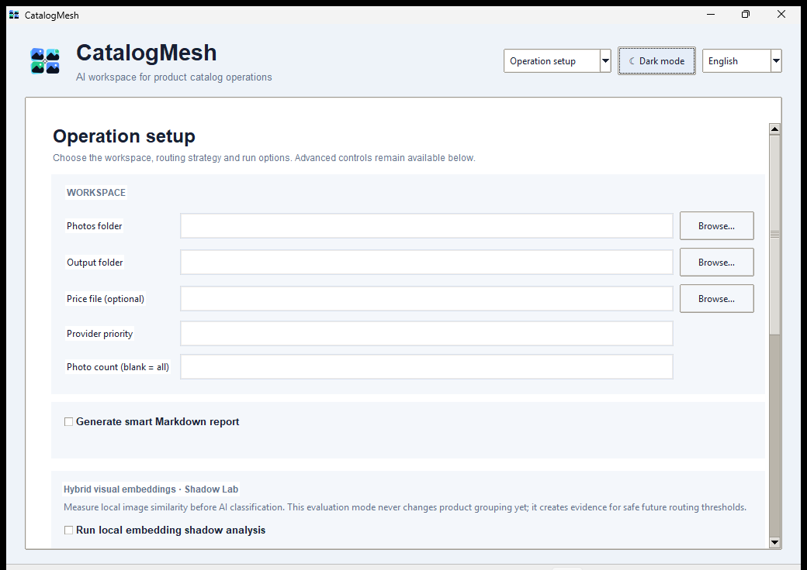

> **Release status:** `v3.2.0` is the current public stable release. `main` contains unreleased v3.3 work and safety hardening.

AI Product Photo Sorter turns a raw chronological product shoot into reviewed product groups, catalog/SKU matches, exports and controlled connector actions. The original photos stay untouched. Human review remains the authority for catalog identity and externally visible publication.

## What is included

| Area | Capabilities |
|---|---|
| **Sorting engine** | Multi-angle product grouping, crash-safe SQLite resume, progress/ETA and reports. |
| **Cloud AI** | Gemini, OpenAI and Anthropic provider pools with model discovery and key rotation. |
| **Local AI** | Ollama local vision, local-only and local-first/cloud-fallback workflows. |
| **Local evidence** | Embeddings Shadow Mode, OCR, barcode evidence, calibration and Hybrid Routing Lab. |
| **Review Center** | Non-destructive merge/split/move, corrections, approval state and audit history. |
| **SKU matching** | Ranked deterministic catalog candidates with mandatory human confirmation. |
| **Exports** | Safe offline Shopify draft and neutral PIM export profiles. |
| **Automation Center** | Desktop GUI generated from the same automation CLI parser, so command parity is tested automatically. |
| **Connectors** | Approval-aware Shopify, Akeneo and Odoo execution with connector-specific safety boundaries. |
| **MCP** | Safe scan/audit/proposal tools only; no generic remote-mutation or publish executor is exposed. |
| **CI / delivery** | Tests, CodeQL, safety workflows, cross-platform packages and packaged Windows GUI smoke screenshots. |

## GUI and CLI parity

The normal sorter GUI and CLI share the same processing engine. The desktop **Automation Center** is additionally generated from `automation_cli.build_parser()`, which means every `product-sorter-automation` subcommand receives a corresponding GUI form automatically.

The GUI does **not** duplicate or weaken remote execution logic. Shopify, Akeneo and Odoo actions still call the same approval-aware connector functions as the CLI. Remote mutation commands require the existing approval + single-use reservation artifacts and an additional GUI confirmation phrase.

```text
CLI command added
      ↓
automation_cli.build_parser()
      ↓
CLI parser + Automation Center form
      ↓
shared connector / safety implementation
```

A CI test compares the complete GUI command catalog with the canonical CLI subcommand set so future command drift fails the test suite.

## Installation

Requires Python 3.10+.

```bash
python -m pip install --upgrade ai-product-photo-sorter
```

Main entry points:

```text
product-sorter             normal sorter CLI
product-sorter-gui         desktop GUI
product-sorter-setup       guided setup
product-sorter-automation  catalog / connector automation CLI
product-sorter-watch       watched-folder daemon
product-sorter-mcp         optional MCP server
```

Optional local and MCP extras:

```bash
python -m pip install "ai-product-photo-sorter[local-embeddings]"
python -m pip install "ai-product-photo-sorter[local-evidence]"
python -m pip install "ai-product-photo-sorter[mcp]"
```

Ready-to-run Windows, Linux and macOS packages are available from the latest GitHub Release.

## Test the unreleased source build

To try the newest code from `main` before a public v3.3 release, use a virtual environment and install the repository in editable mode.

```bash
git clone https://github.com/mhmdwaelanwr/ai-product-photo-sorter.git
cd ai-product-photo-sorter
git checkout main
git pull --ff-only
python -m venv .venv
```

Activate the environment, then install and run the desktop app.

```bash
# Linux / macOS
source .venv/bin/activate
python -m pip install --upgrade pip
python -m pip install -e .
product-sorter-gui
```

```powershell
# Windows PowerShell
.\.venv\Scripts\Activate.ps1
python -m pip install --upgrade pip
python -m pip install -e .
product-sorter-gui
```

Useful smoke checks before using real product data:

```bash
product-sorter-automation --help
product-sorter-automation scan ./your-test-photo-folder
python -m unittest discover -s tests -t . -v
python -m compileall -q src product_sorter.py product_sorter_gui.py set_data.py scripts
```

To test the current PR before it reaches `main`, replace `git checkout main` with:

```bash
git fetch origin feat/v3.3-gui-cli-parity-cleanup
git checkout feat/v3.3-gui-cli-parity-cleanup
git pull --ff-only
```

Do not use production Shopify/Akeneo/Odoo credentials while casually testing the GUI. Local scan, review, SKU matching, offline exports and command previews are enough to validate most of the workflow without external mutation.

## Main workflow

```mermaid
flowchart LR
    A[Raw shoot] --> B[Cloud or local vision]
    B --> C[Product groups]
    C --> D[Human Review Center]
    D --> E[SKU candidates]
    E --> F[Human SKU confirmation]
    F --> G[Offline exports / connector plans]
    G --> H[Approval request]
    H --> I[Human approval]
    I --> J[Single-use reservation]
    J --> K[Connector-specific execution]
```

Sorting, review and automation never treat an AI guess as confirmed catalog identity.

## Automation CLI / Automation Center

Current automation commands are defined once in `src/ai_product_photo_sorter/automation_cli.py` and are exposed by both the terminal entry point and the desktop Automation Center.

Examples:

```bash
product-sorter-automation scan ./shoot
product-sorter-automation missing-assets ./catalog.xlsx
product-sorter-automation missing-local ./catalog.xlsx ./shoot
product-sorter-automation propose-matches approved_groups.csv catalog.xlsx --top-k 5
product-sorter-automation open-review-queue review_manifest.json
product-sorter-automation prepare-shopify-draft sku_match_manifest.json
product-sorter-automation prepare-connector-plan export_manifest.json profile.json
```

Approval lifecycle commands are also available in both surfaces:

```text
request-external-action
approve-external-action
validate-approval
reserve-approved-action
record-execution-result
```

Connector-specific commands include:

```text
execute-shopify-stage
execute-shopify-publish
execute-shopify-rollback
execute-akeneo-products
reconcile-akeneo-execution
execute-akeneo-rollback
execute-odoo-products
reconcile-odoo-execution
```

The watched-folder command is available as `watch` and retains its crash-safe checkpoint behavior.

## Remote execution safety

Remote writes intentionally have a stronger boundary than local analysis:

- credentials come from environment/keyring configuration, not approval payload files;
- action, request, payload and reservation identity are validated before execution;
- reservations are single-use and consumed before mutation;
- secret-like payload keys are rejected/redacted;
- publication is a separate approved Shopify action;
- Akeneo rollback requires a fresh reconciliation fingerprint and fails closed on remote drift;
- partial or ambiguous connector writes require reconciliation instead of blind retries;
- there is no generic arbitrary connector executor;
- MCP does not expose remote mutation or publication tools.

Local approval artifacts provide integrity checks for the expected local workflow, but they are **not cryptographic signatures against a hostile local user**.

## Desktop GUI

The desktop app includes operation setup, provider/model management, results, Benchmark Center, Environment Center, Review/SKU/export workflows, Automation Center, Report Center and About information.

Light/dark packaged-Windows screenshots are generated by CI. After a successful `main` build, the `gui-docs-sync` workflow downloads the real executable smoke-test artifact and refreshes `docs/screenshots/ci/windows/` automatically, so README screenshots do not depend on manual captures.

| Workspace | Light | Dark |
|---|---|---|
| **Operation** |  | 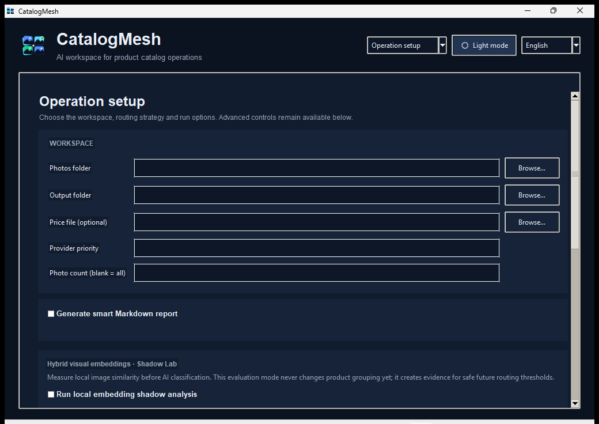 |
| **Models** | 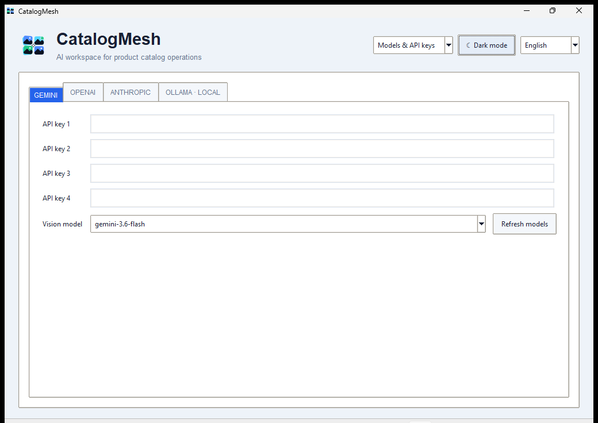 | 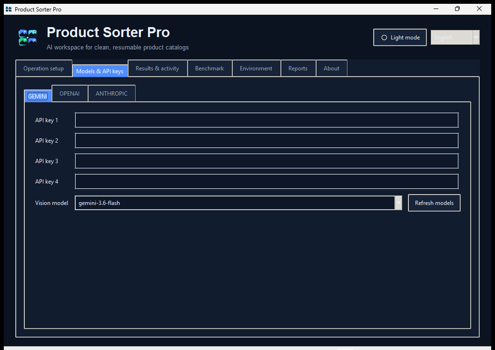 |
| **Results** | 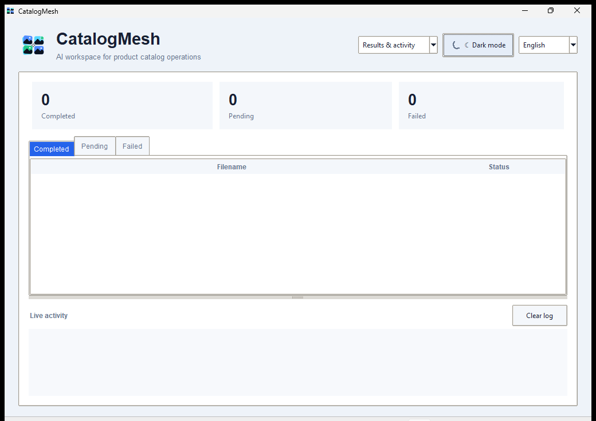 | 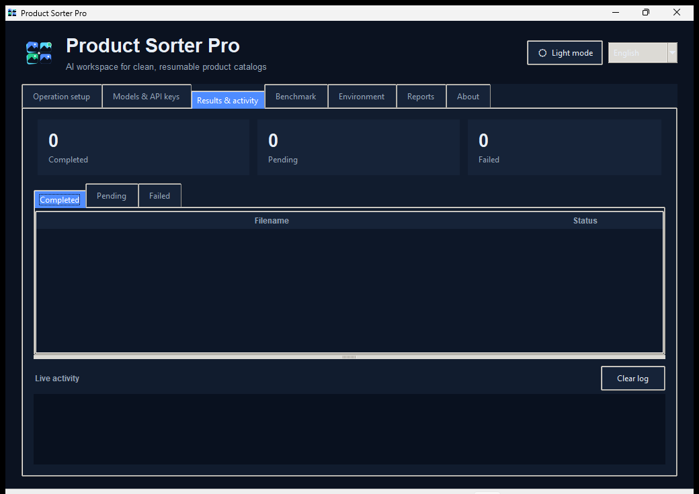 |
| **Benchmark** | 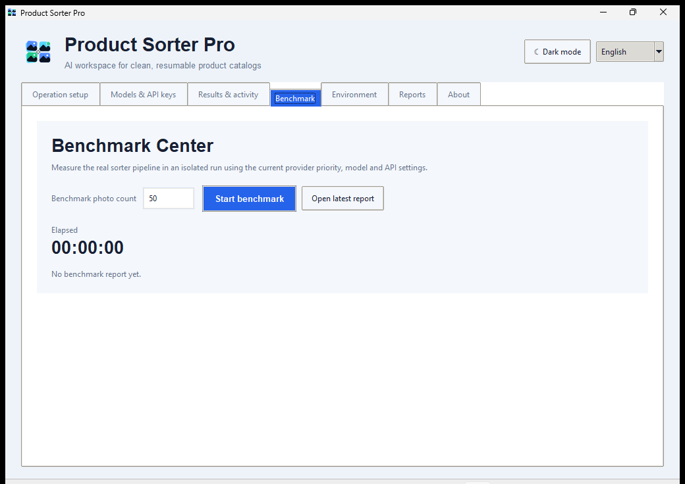 | 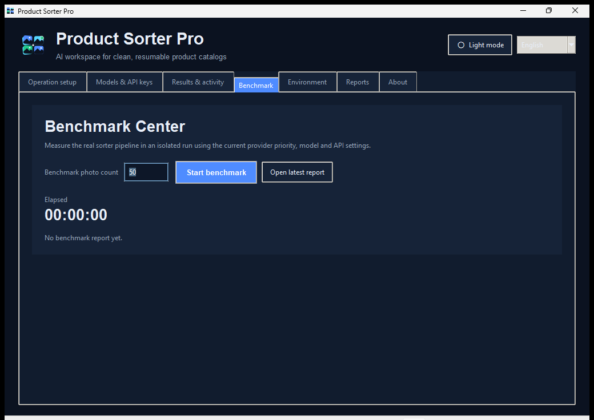 |
| **Environment** | 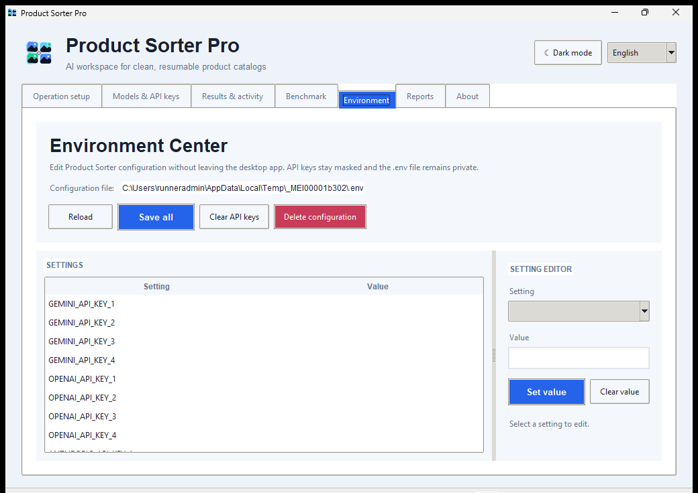 | 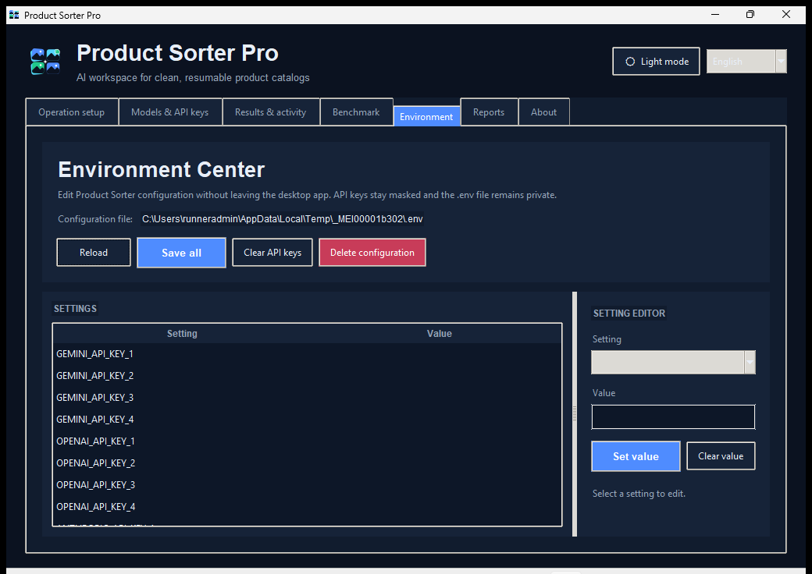 |
| **Reports** | 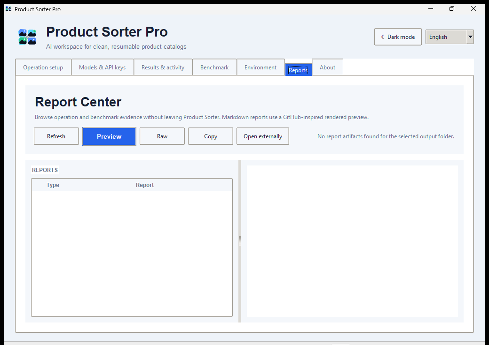 | 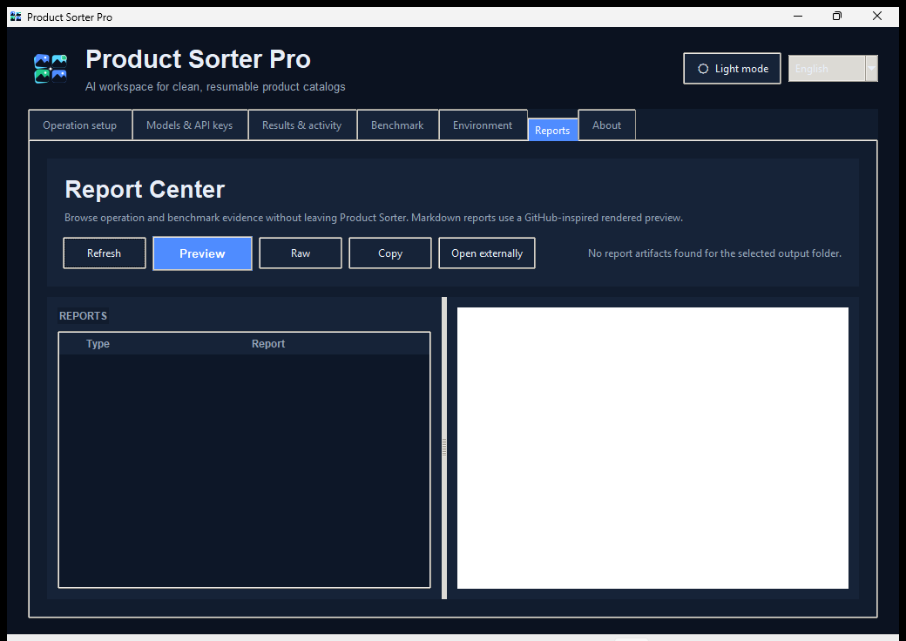 |
| **About** | 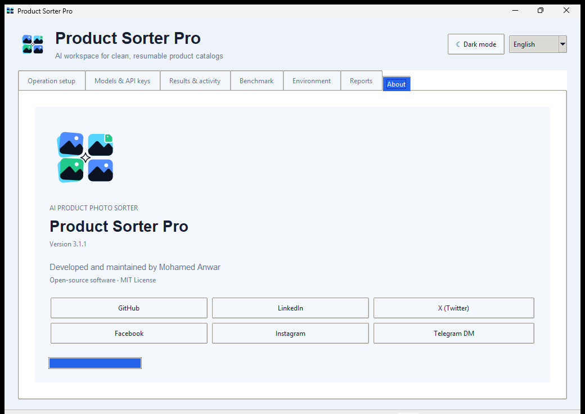 | 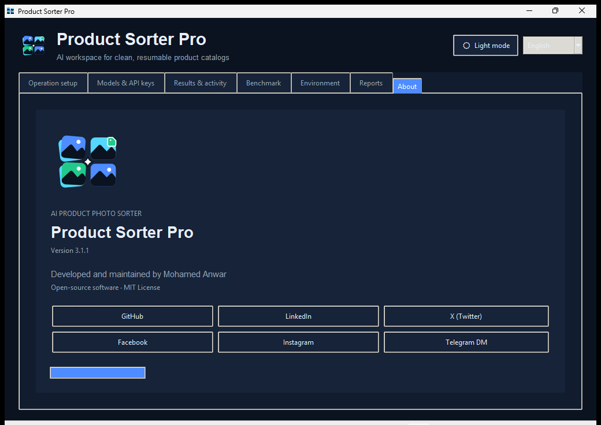 |

## Project layout

```text
.
├── src/ai_product_photo_sorter/   canonical application package
│   ├── core.py                    shared sorter facade
│   ├── gui.py                     desktop composition
│   ├── automation_cli.py          canonical automation command parser
│   ├── automation_gui.py          parser-driven Automation Center
│   ├── review_center*.py          review engine + GUI
│   ├── sku_matching*.py           SKU matching engine + GUI
│   ├── shopify_*.py               Shopify guarded workflow
│   ├── akeneo_*.py                Akeneo execution / rollback
│   └── odoo_execution.py          Odoo execution / reconciliation
├── tests/                         unit + safety + parity tests
├── scripts/                       build, fixture and smoke tooling
│   └── smoke/                     canonical smoke launchers
├── docs/                          architecture and feature documentation
├── assets/branding/               application artwork/icons
└── packaging/                     Linux and PyInstaller packaging
```

The small top-level/source compatibility wrappers remain intentionally for existing launch and packaging paths; duplicate smoke launchers have been removed in favor of `scripts/smoke/`.

## Development

```bash
git clone https://github.com/mhmdwaelanwr/ai-product-photo-sorter.git
cd ai-product-photo-sorter
python -m venv .venv
python -m pip install -e .
python -m unittest discover -s tests -t . -v
python -m compileall -q src product_sorter.py product_sorter_gui.py set_data.py scripts
```

Important documentation:

- [Architecture](docs/ARCHITECTURE.md)
- [Review Center](docs/REVIEW_CENTER.md)
- [SKU matching](docs/SKU_MATCHING.md)
- [Catalog automation](docs/CATALOG_AUTOMATION.md)
- [Connector profiles](docs/CONNECTOR_PROFILES.md)
- [Shopify execution boundary](docs/SHOPIFY_EXECUTION_BOUNDARY.md)
- [Akeneo execution](docs/AKENEO_EXECUTION.md)
- [Odoo execution](docs/ODOO_EXECUTION.md)
- [MCP automation](docs/MCP_AUTOMATION.md)
- [Security policy](SECURITY.md)

## License

MIT — see [LICENSE](LICENSE).
