<div align="center">


# AI Product Photo Sorter

### Turn chronological product-shoot photos into an organized, reviewable catalog.

Desktop GUI + CLI · Multi-provider vision · Safe resume · Automatic key rotation

[](https://github.com/mhmdwaelanwr/ai-product-photo-sorter/actions/workflows/tests.yml)
[](https://www.python.org/)
[](https://github.com/mhmdwaelanwr/ai-product-photo-sorter)
[](LICENSE)
[](#installation)

[Features](#features) · [Screenshots](#desktop-gui) · [Installation](#installation) · [Configuration](#api-configuration) · [Troubleshooting](#troubleshooting)

</div>

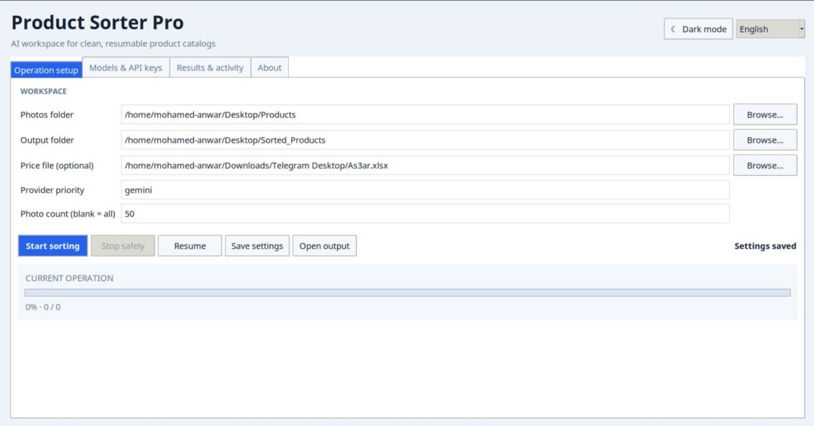

AI Product Photo Sorter analyzes a continuous photo-shoot sequence, recognizes
which front, back, side, packaging, and detail shots belong to the same product,
then creates an organized catalog without moving, renaming, or deleting the
source files.

## Features

| Capability | What it provides |
|---|---|
| **Multi-provider vision** | Gemini, OpenAI, and Anthropic with ordered fallback. |
| **Key pools** | One to four keys per provider—up to 12 configured keys—with automatic quota/rate-limit rotation. |
| **Live model discovery** | Provider model catalogs refreshed from configured credentials; multi-key pools expose only shared models. |
| **Crash-safe resume** | Successful batches are committed to SQLite immediately and can be resumed from the same output folder. |
| **Professional GUI + CLI** | One shared engine, live status, ETA, completed/pending/failed views, logs, and graceful stopping. |
| **Dark and light themes** | Instant persistent appearance switching from the desktop header. |
| **Multilingual UI** | Arabic, English, and Chinese with device-language detection. |
| **Quality controls** | Confidence review folders, CSV reports, usage tracking, internet/latency checks, and failure exports. |
| **Cross-platform delivery** | Linux, Windows, and macOS launchers plus PyInstaller packaging support. |

## Brand assets

The official Smart Photo Stack identity is available in production-ready forms:

- Transparent and themed PNG artwork from `16×16` through `1024×1024`.
- Scalable SVG source plus a simplified small-size SVG.
- Multi-resolution Windows `.ico` and macOS `.icns` application icons.
- Dedicated dark and light presentation variants.

All official files live in [`assets/branding`](assets/branding).

## Safety by design

- Originals are never deleted, moved, renamed, or overwritten.
- `.env`, credentials, runtime databases, output folders, and logs are excluded from Git.
- API keys remain masked in the GUI and can optionally be stored in the OS keyring.
- Product images are sent only to the selected provider; review its privacy and billing terms before processing sensitive material.
- AI output is probabilistic. Low-confidence classifications are separated for human review.

## Installation

Requires Python 3.10 or newer.

```bash
git clone https://github.com/mhmdwaelanwr/ai-product-photo-sorter.git
cd ai-product-photo-sorter
python -m venv .venv
```

Activate the environment:

```bash
# Linux/macOS
source .venv/bin/activate

# Windows PowerShell
.venv\Scripts\Activate.ps1
```

Install and configure:

```bash
python -m pip install -r requirements.txt
python set_data.py
```

Run the GUI or CLI:

```bash
python product_sorter_gui.py
python product_sorter.py
```

Platform launchers are also available: `start.bat`, `start.command`, and `start.sh`.

## How it works

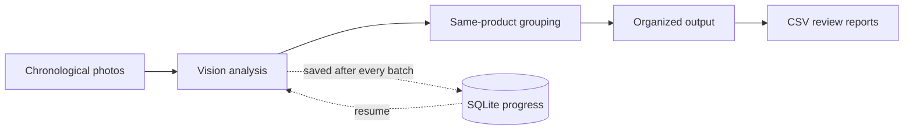

The engine analyzes overlapping batches so a front photo can stay connected to
the back, side, packaging, and detail photos that follow it. Each successful
batch is committed to SQLite immediately. If the app closes, the internet drops,
or a key reaches quota, reopening the same output folder continues from saved
work rather than starting over.

## Desktop GUI

The GUI and CLI use the same processing engine and progress database. The GUI is
organized into four workspaces and supports persistent light and dark themes.

### Operation workspace

| Main setup | Native folder selection |
|---|---|
| 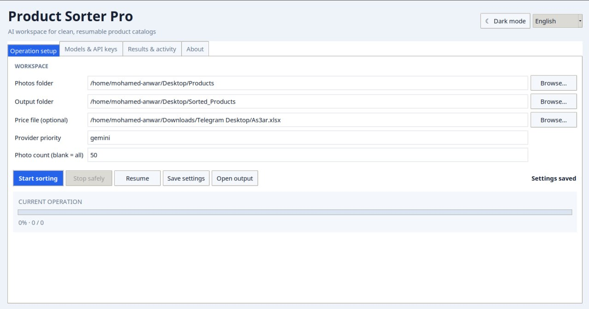 | 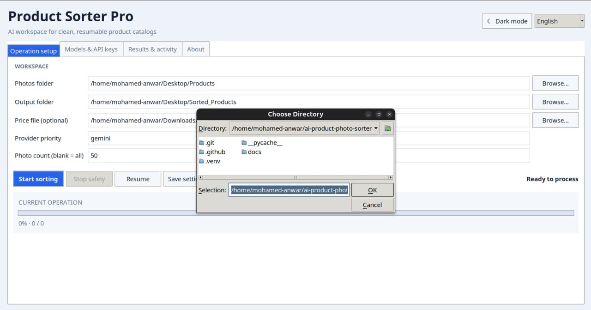 |
| The operation dashboard keeps the photo source, output destination, optional Excel price catalog, provider priority, sample size, actions, and progress in one focused screen. | Native system dialogs make selecting source and output directories familiar and reduce path-entry mistakes. |

| Inspecting generated files | Dark operation workspace |
|---|---|
| 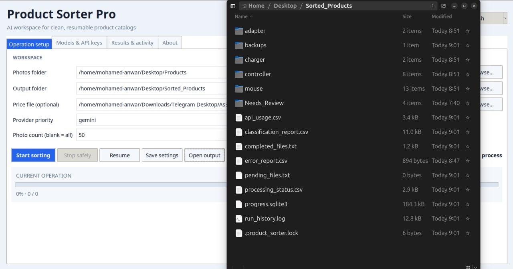 | 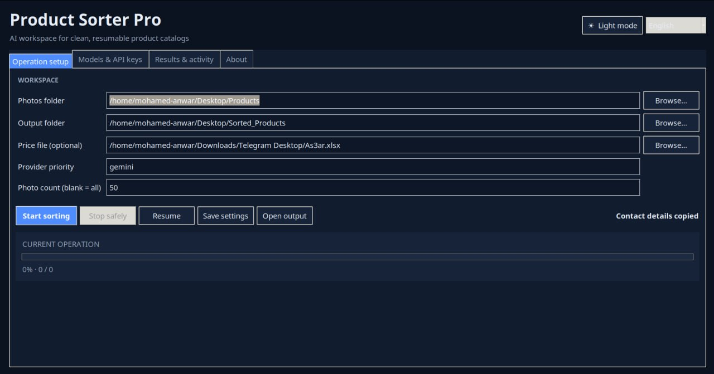 |
| **Open output** takes the user directly to the organized folders, CSV reports, progress database, usage data, and run history produced by the current operation. | The same complete workflow in the low-glare dark palette. The selected theme is saved and restored on the next launch. |

### Providers, keys, and live model discovery

| Gemini key pool | Gemini model menu |
|---|---|
| 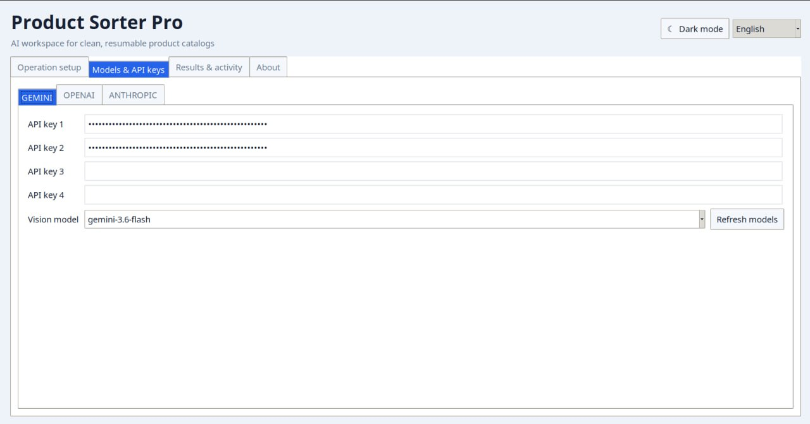 | 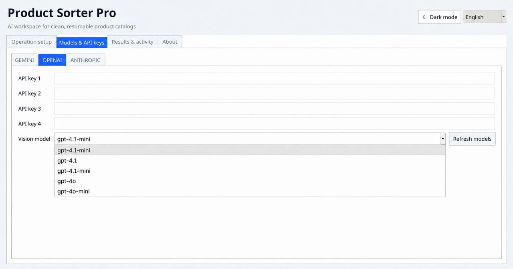 |
| Four masked Gemini key slots form one rotation pool. The selected vision model is shared by the pool so quota switching remains safe. | The model selector uses the refreshed provider catalog while still allowing the user to inspect and change the active model. |

| Anthropic model menu | Dark provider workspace |
|---|---|
| 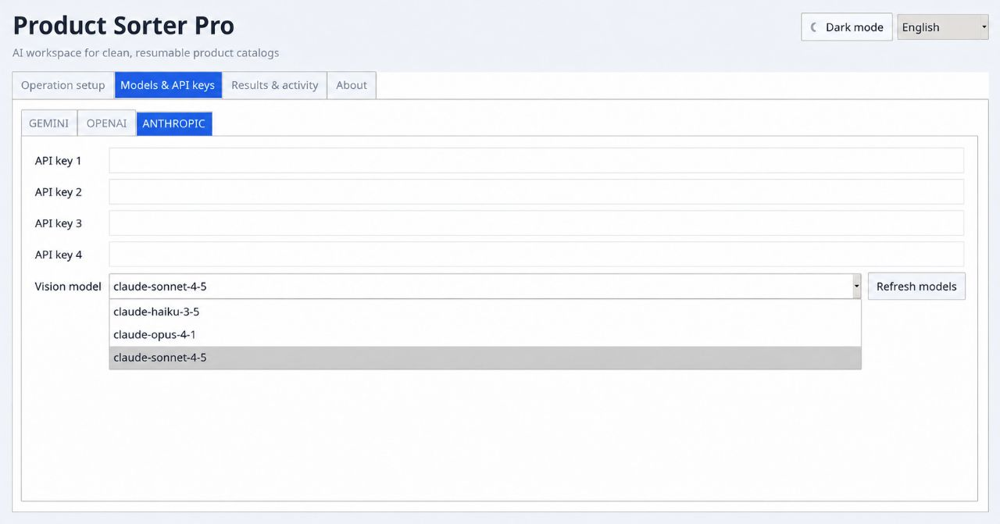 | 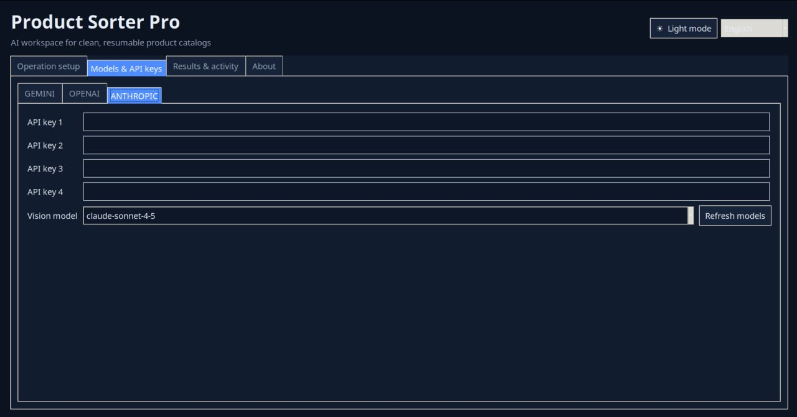 |
| Provider-specific catalogs keep Anthropic choices separate from Gemini and OpenAI while preserving the same four-key workflow. | API configuration remains readable in dark mode, with masked credentials, consistent spacing, and a dedicated model refresh action. |

| Shared-model verification | Full live catalog |
|---|---|
| 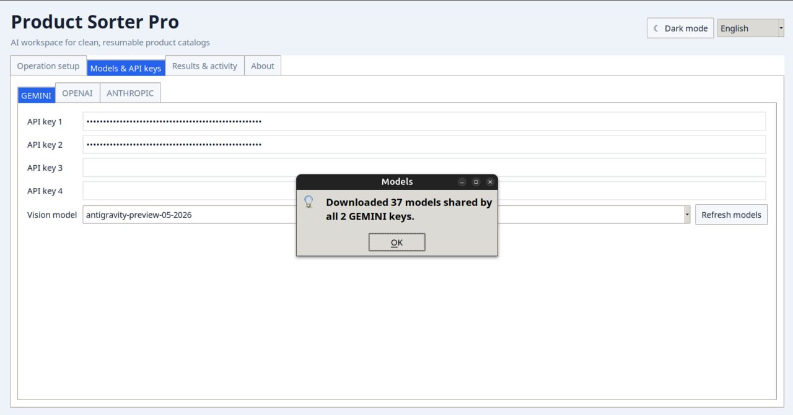 | 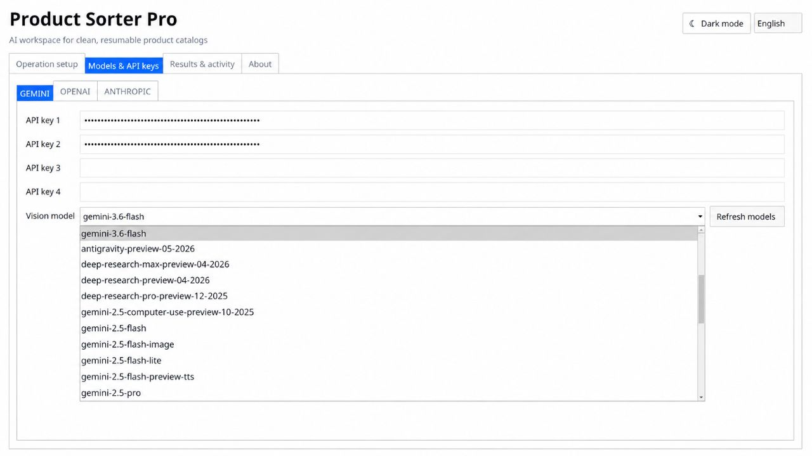 |
| After refresh, the GUI confirms how many models are shared by the configured keys. This prevents rotation to a key that cannot access the chosen model. | The live dropdown exposes the provider's currently available models instead of relying only on a hard-coded list—important when models are added or retired. |

### Results and activity

| Completed | Pending |
|---|---|
| 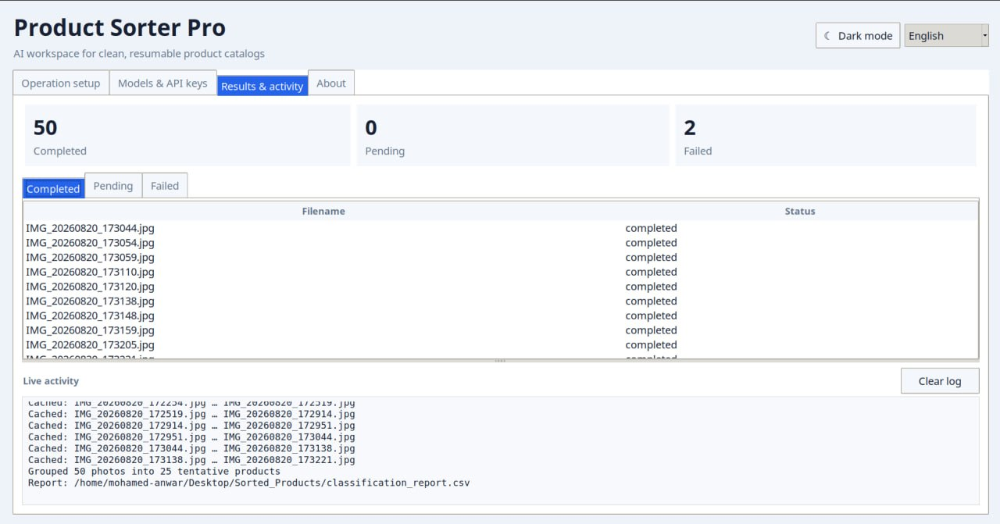 | 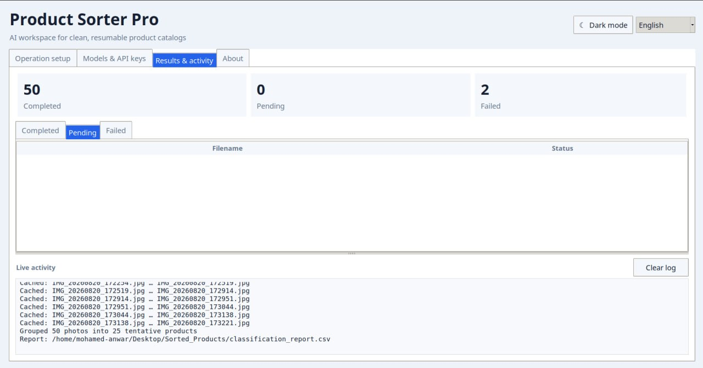 |
| Completed photos are listed by filename with a clear status, while the summary cards show operation totals at a glance. | The pending view makes the remaining workload explicit and stays synchronized with the persistent processing report. |

| Failed requests | Dark diagnostics |
|---|---|
| 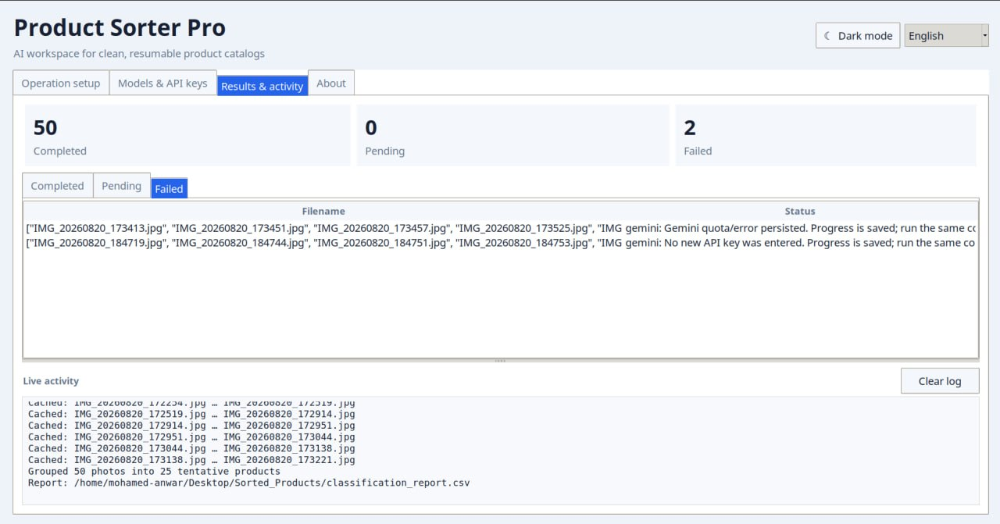 | 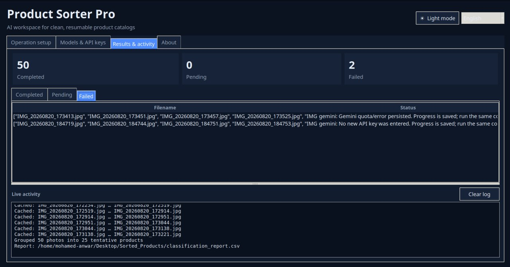 |
| Errors retain their affected filenames and provider message for troubleshooting. The live activity panel preserves internet checks, batches, rotation events, and safe-stop messages. | Dark diagnostics provide the same failure detail and operational log without sacrificing contrast during long processing sessions. |

### About and open source

| Light About workspace | Dark About workspace |
|---|---|
| 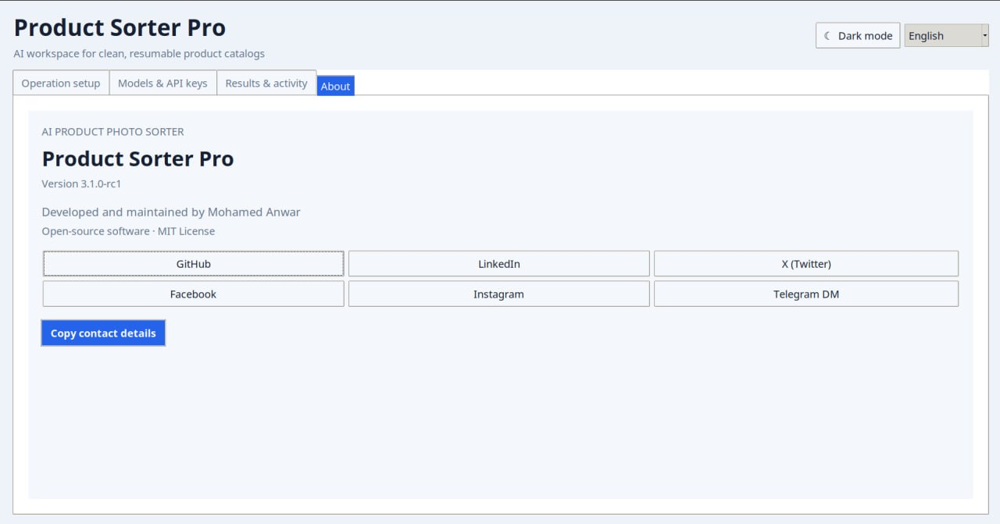 | 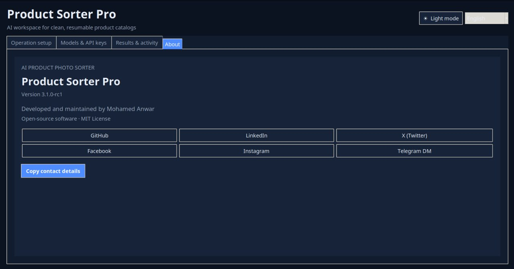 |
| The About page identifies the application version, developer and maintainer, MIT license, social profiles, and one-click contact copying. | The open-source identity and developer links remain a first-class part of the application in both themes. |

1. **Operation setup** — choose source/output folders, optional price workbook,
   provider priority, and an optional sample size.
2. **Models & API keys** — configure one to four keys per provider and refresh
   the model list shared by those keys.
3. **Results & activity** — follow the current operation, inspect completed,
   pending, and failed counts, read logs, and open the output directory.
4. **About** — project version, developer information, open-source license, and
   direct links to the maintainer's profiles.

Use the sun/moon button in the header to switch between dark and light mode.
The selection is saved automatically in `.env` as `APP_THEME`.

Stopping from the GUI is graceful: the active request finishes, its checkpoint
is saved, and the same operation can be resumed later.

## API configuration

Copy `.env.example` to `.env`, or use `python set_data.py`. You may configure only one key or as many as four per provider:

```dotenv
AI_PROVIDERS=gemini,openai,anthropic
GEMINI_API_KEY_1=your_key
GEMINI_API_KEY_2=
OPENAI_API_KEY_1=your_key
ANTHROPIC_API_KEY_1=your_key
```

Providers are attempted in the listed order. Keys rotate only for quota and rate-limit failures; connectivity and invalid-request errors are handled separately.

The setup wizard checks every configured key and displays only models shared by all of them, so automatic key rotation cannot switch to a key that lacks the selected model. The GUI provides the same selection through a model dropdown and **Refresh models** button. `provider_models.json` is the offline fallback catalog and is refreshed without storing API keys. Completed batches remain cached if the model is changed later.

### Choosing a model

Use **Refresh models** after entering the provider keys. The app queries the
provider and keeps only models available to every configured key. This prevents
processing from failing halfway through when key rotation selects a key without
access to the chosen model. If an old model returns `404 NOT_FOUND`, refresh the
list and choose a current vision-capable model; saved photos will not be repeated.

## Outputs

```text
Sorted_Products/
├── <category>/<product>/       # organized product views
├── Needs_Review/               # low-confidence classifications
├── classification_report.csv  # final AI classification report
├── processing_status.csv       # completed and pending photos
├── completed_files.txt
├── pending_files.txt
├── error_report.csv
├── usage_report.csv
├── run_history.log
└── progress.sqlite3            # resumable operation state
```

The output folder is the operation identity. Reusing it resumes its saved
progress; choosing a different output folder starts an independent operation.

## Troubleshooting

| Symptom | What to do |
|---|---|
| Model returns `404 NOT_FOUND` | Refresh models and select a currently available vision model. |
| A key reaches quota | The app rotates to the next key; after all keys are exhausted it asks for another. |
| Internet disconnects | Retry after reconnecting; completed batches remain saved. |
| Progress appears paused | The current API request is still running; the count advances after the batch is saved. |
| Large-image Pillow warning | Product photos are still downscaled for requests; inspect unexpected files if the image is untrusted. |

## Tests

```bash
python -m unittest discover -v
python -m py_compile *.py
```

The suite includes a synthetic image-to-report integration flow and key-rotation scenarios. Live checks are opt-in:

```bash
python live_api_smoke.py
python gui_smoke.py
```

See [PRODUCTION_CHECKLIST.md](PRODUCTION_CHECKLIST.md) for checks requiring real credentials, a graphical desktop, or a labeled product dataset.

## Contributing and security

Read [CONTRIBUTING.md](CONTRIBUTING.md) before opening a pull request. Report vulnerabilities according to [SECURITY.md](SECURITY.md). Never include API keys or private product images in an issue.

## Developer

Developed and maintained by **Mohamed Anwar**.

- [GitHub](https://github.com/mhmdwaelanwr)
- [LinkedIn](https://linkedin.com/in/mhmdwaelanwr)
- [X (Twitter)](https://x.com/mhmdwaelanwr)
- [Facebook](https://facebook.com/mhmdwaelanwr)
- [Instagram](https://instagram.com/mhmdwaelanwr)
- [Telegram DM](https://t.me/Mhmdwaelanwer)

## License

MIT — see [LICENSE](LICENSE).
