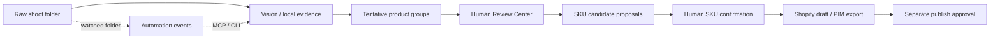

<div align="center">


# AI Product Photo Sorter

### Turn raw product shoots into a reviewed, SKU-aware catalog workflow.

Desktop GUI + CLI · Cloud & local vision · Review + SKU matching · Shopify drafts · MCP automation · Watched folders

[](https://github.com/mhmdwaelanwr/ai-product-photo-sorter/actions/workflows/tests.yml)
[](https://www.python.org/)
[](https://github.com/mhmdwaelanwr/ai-product-photo-sorter/releases/latest)
[](https://pypi.org/project/ai-product-photo-sorter/)
[](LICENSE)
[](#installation)

[](https://github.com/mhmdwaelanwr/ai-product-photo-sorter/releases/latest/download/ProductSorterPro-windows-x64.zip)
[](https://github.com/mhmdwaelanwr/ai-product-photo-sorter/releases/latest/download/product-sorter-pro_3.2.0_all.deb)
[](https://github.com/mhmdwaelanwr/ai-product-photo-sorter/releases/latest/download/ProductSorterPro-macos-arm64.zip)
[](https://github.com/mhmdwaelanwr/ai-product-photo-sorter/releases/latest/download/ProductSorterPro-macos-x64.zip)

[Features](#features) · [Installation](#installation) · [Automation & MCP](#catalog-automation-and-mcp) · [Benchmark](BENCHMARK.md) · [Roadmap](ROADMAP.md) · [Limitations](KNOWN_LIMITATIONS.md)

</div>


AI Product Photo Sorter starts with the messy part of commerce photography: a
chronological folder containing front, back, side, packaging, and detail photos.
It groups the shoot into tentative products, lets a human review the groups,
proposes catalog/SKU matches, and can prepare safe Shopify/PIM outputs without
modifying the original photos.

The stable `v3.2.0` release adds local-first catalog automation, MCP tooling, a
persistent watched-folder daemon, missing-asset audits, and dedicated automation
commands while preserving mandatory human confirmation before catalog identity
or external publication is accepted.

## Quick demo


## Features

| Capability | What it provides |
|---|---|
| **Product-shoot grouping** | Groups chronological multi-angle product photos while preserving original files. |
| **Multi-provider vision** | Gemini, OpenAI, and Anthropic pools with ordered fallback and key rotation. |
| **Local-first vision** | First-class Ollama provider, local-only operation, and local-first/cloud-fallback modes. |
| **Hybrid evidence** | Optional local image embeddings, OCR, barcode evidence, threshold calibration, and routing simulation. |
| **Review Center** | Non-destructive merge/split/move, metadata corrections, approval state, and append-only audit history. |
| **SKU/catalog matching** | Ranked deterministic candidates using approved groups and optional local evidence; human confirmation is mandatory. |
| **Catalog exports** | Offline Shopify draft and neutral PIM exports from fully confirmed matches only. |
| **Guarded Shopify workflow** | Query-only preview, explicit draft staging, SKU collision protection, idempotency state, separately confirmed publication, and rollback to `DRAFT`. |
| **Missing Asset Audit** | Finds SKUs with no image reference and conservatively checks for same-stem local image candidates. |
| **Watched folders** | Persistent polling daemon with crash-safe checkpoints and deterministic added/changed/removed events. |
| **Automation CLI** | Scriptable scan → audit → candidate proposal → confirmed Shopify draft workflow. |
| **MCP server** | Optional stdio server for compatible AI/automation hosts; no publish tool is exposed. |
| **Benchmark Center** | Real-pipeline timing, throughput, provider/model metrics, cost estimates, hardware evidence, JSON history, and optional ground truth. |
| **Desktop workflow** | Multilingual Tkinter GUI with light/dark themes, progress/ETA, Environment Center, Report Center, and benchmark workspace. |
| **Cross-platform delivery** | Windows x64, Linux x64/DEB, native macOS arm64/x64, PyPI wheel, and source distribution. |

## How it works



The core sorter analyzes overlapping batches and commits successful progress to
SQLite immediately, so interrupted operations can resume instead of restarting.
Review and catalog stages are intentionally separate: an AI grouping result is
not treated as verified catalog identity.

## Installation

### PyPI

Requires Python 3.10 or newer.

```bash
python -m pip install --upgrade ai-product-photo-sorter
```

Available commands:

```text
product-sorter             normal CLI
product-sorter-gui         desktop GUI
product-sorter-setup       guided provider/configuration setup
product-sorter-automation  safe catalog automation CLI
product-sorter-watch       watched-folder daemon
```

### Optional MCP support

MCP dependencies stay opt-in so normal desktop/CLI installs remain lightweight:

```bash
python -m pip install --upgrade "ai-product-photo-sorter[mcp]"
product-sorter-mcp
```

See [MCP_AUTOMATION.md](docs/MCP_AUTOMATION.md) for the tool contract and host
configuration model.

### Ready-to-run desktop builds

| Platform | Download | Start |
|---|---|---|
| **Windows x64** | [`ProductSorterPro-windows-x64.zip`](https://github.com/mhmdwaelanwr/ai-product-photo-sorter/releases/latest/download/ProductSorterPro-windows-x64.zip) | Extract and run `ProductSorterPro.exe`. |
| **Linux x64 (Debian/Ubuntu)** | [`product-sorter-pro_3.2.0_all.deb`](https://github.com/mhmdwaelanwr/ai-product-photo-sorter/releases/latest/download/product-sorter-pro_3.2.0_all.deb) | `sudo apt install ./product-sorter-pro_3.2.0_all.deb` |
| **Linux x64 (standalone)** | [`ProductSorterPro-linux-x64.tar.gz`](https://github.com/mhmdwaelanwr/ai-product-photo-sorter/releases/latest/download/ProductSorterPro-linux-x64.tar.gz) | Extract and run `ProductSorterPro`. |
| **macOS Apple Silicon** | [`ProductSorterPro-macos-arm64.zip`](https://github.com/mhmdwaelanwr/ai-product-photo-sorter/releases/latest/download/ProductSorterPro-macos-arm64.zip) | Extract and open `ProductSorterPro.app`. |
| **macOS Intel** | [`ProductSorterPro-macos-x64.zip`](https://github.com/mhmdwaelanwr/ai-product-photo-sorter/releases/latest/download/ProductSorterPro-macos-x64.zip) | Extract and open `ProductSorterPro.app`. |

Release assets also contain the Python wheel, source archive, and
`SHA256SUMS.txt` integrity manifest.

> Desktop binaries are not yet code-signed or Apple-notarized. Windows
> SmartScreen or macOS Gatekeeper may show a first-launch warning.

### Build from source

```bash
git clone https://github.com/mhmdwaelanwr/ai-product-photo-sorter.git
cd ai-product-photo-sorter
python -m venv .venv
# activate the environment, then:
python -m pip install -e .
product-sorter-setup
product-sorter-gui
```

For local embeddings/evidence or MCP, install the matching optional extras from
`pyproject.toml`.

## Catalog automation and MCP

The automation surface deliberately stops before external publication.

```bash
product-sorter-automation scan ./shoot
product-sorter-automation missing-assets ./catalog.xlsx
product-sorter-automation missing-local ./catalog.xlsx ./shoot
product-sorter-automation propose-matches ./approved_groups.csv ./catalog.xlsx --top-k 5
product-sorter-automation prepare-shopify-draft ./sku_matching/sku_match_manifest.json
product-sorter-automation watch ./shoot --state ./.product-sorter-watch.json --interval 5
```

A compatible MCP host can orchestrate the same safe flow:

```text
scan shoot
  → show missing SKUs
  → propose matches
  → human review / SKU confirmation
  → prepare Shopify draft
```

MCP tools in v3.2.0:

- `scan_shoot`
- `show_missing_skus`
- `show_missing_local_skus`
- `propose_matches`
- `prepare_shopify_draft`

There is deliberately **no `publish` tool** in the MCP or automation CLI
surface. `prepare_shopify_draft` delegates to the existing fail-closed catalog
exporter, so pending SKU matches block draft preparation.

The watched-folder daemon stores a JSON checkpoint using atomic, per-write temp
files and emits deterministic `added`, `changed`, and `removed` events. It never
moves or renames source images.

## Local-first catalog pipeline

The current strategic pipeline is:

```text
Local/Ollama vision
→ optional local embeddings/OCR/barcode evidence
→ product grouping
→ Review Center
→ SKU candidate ranking
→ human confirmation
→ Shopify/PIM draft
→ separately confirmed publication
```

Local embedding routing remains conservative: Shadow Mode, calibration, and the
Hybrid Routing Lab provide measurable evidence before local decisions are ever
promoted into production routing. See:

- [LOCAL_AI.md](LOCAL_AI.md)
- [Hybrid embeddings](docs/HYBRID_EMBEDDINGS.md)
- [Threshold calibration](docs/THRESHOLD_CALIBRATION.md)
- [Hybrid Routing Lab](docs/HYBRID_ROUTING_LAB.md)
- [Local evidence](docs/LOCAL_EVIDENCE.md)
- [Review Center](docs/REVIEW_CENTER.md)
- [SKU matching](docs/SKU_MATCHING.md)
- [Catalog exports](docs/CATALOG_EXPORTS.md)
- [Shopify publishing](docs/SHOPIFY_PUBLISHING.md)

## Safety by design

- Originals are never deleted, moved, renamed, or overwritten by sorting/review/automation stages.
- SKU proposals are suggestions until a human explicitly confirms a catalog row.
- Offline Shopify draft preparation performs zero network calls.
- External Shopify publication remains separately confirmed and audited.
- Exact-SKU collision protection and local idempotency state guard remote staging.
- API keys are masked in the GUI and can use the operating-system keyring.
- `.env`, credentials, runtime databases, output folders, and logs are excluded from Git.
- Product images are sent only to the selected provider; local Ollama mode can operate without public internet.

## Benchmark Center

Benchmark mode measures the same production sorting path in a fresh isolated run:

```bash
product-sorter --source ./Products --output ./Sorted_Products --limit 100 --benchmark
```

A run writes human- and machine-readable evidence under
`Sorted_Products/benchmarks/`, including `BENCHMARK_REPORT.md`, `benchmark.json`,
status/usage data, and reproducibility metadata. Add `--ground-truth expected.csv`
to include measured classification accuracy.

The project intentionally does not publish guessed performance numbers. See
[BENCHMARK.md](BENCHMARK.md) for methodology and comparison rules.

## Desktop GUI

The packaged Windows interface is continuously smoke-tested from the real
PyInstaller executable.

| Workspace | Light | Dark |
|---|---|---|
| **Operation setup** |  |  |
| **Models & API keys** |  |  |
| **Results & activity** |  |  |
| **Benchmark** |  |  |
| **Environment** |  |  |
| **Reports** |  |  |
| **About** |  |  |

See [GUI_AUTOMATION.md](GUI_AUTOMATION.md) for the packaged-GUI evidence contract.

## Provider and API configuration

Use the GUI Environment/Models workspaces or `product-sorter-setup`. Cloud keys
can be configured for Gemini, OpenAI, and Anthropic, with up to four keys per
provider and safe quota/rate-limit rotation. Ollama does not require a cloud API
key.

A minimal cloud configuration looks like:

```dotenv
AI_PROVIDERS=gemini,openai,anthropic
GEMINI_API_KEY_1=your_key
OPENAI_API_KEY_1=your_key
ANTHROPIC_API_KEY_1=your_key
```

Live model discovery validates the models visible across a configured key pool
before processing starts.

## Outputs

Normal sorting keeps resumable operation state and review evidence alongside the
organized output. Catalog stages create their own review/matching/export
manifests rather than silently mutating the raw shoot.

Typical operation evidence includes:

```text
Sorted_Products/
├── <category>/<product>/
├── Needs_Review/
├── classification_report.csv
├── processing_status.csv
├── error_report.csv
├── api_usage.csv
├── run_history.log
└── progress.sqlite3
```

Additional Review Center, SKU matching, Shopify/PIM export, benchmark, and audit
artifacts are documented in the corresponding files under `docs/`.

## Tests and release verification

```bash
python -m unittest discover -s tests -t . -v
python -m compileall -q src product_sorter.py product_sorter_gui.py set_data.py scripts
```

CI validates Linux, Windows, and macOS on supported Python versions, CodeQL,
local-evidence smoke tests, synthetic benchmarks, Shopify publication safety,
release packaging, artifact downloads, and the packaged Windows GUI.

Stable promotion builds Windows x64, Linux x64/DEB, macOS arm64, macOS x64,
wheel, sdist, and SHA-256 checksums before GitHub Release publication. PyPI uses
OIDC Trusted Publishing.

## Architecture

The canonical runtime lives under `src/ai_product_photo_sorter/`. Important
public workflow modules include:

```text
src/ai_product_photo_sorter/
├── core.py                 shared sorter facade
├── gui.py                  desktop facade
├── benchmark.py            benchmark instrumentation
├── local_ai.py             local/Ollama integration
├── hybrid_embeddings.py    local visual evidence
├── local_evidence.py       OCR/barcode evidence
├── review_center.py        non-destructive review state
├── sku_matching.py         candidate ranking + human confirmation
├── catalog_exports.py      offline Shopify/PIM exports
├── shopify_publishing.py   guarded remote Shopify workflow
├── ingestion.py            shoot snapshot primitives
├── missing_assets.py       missing-image audits
├── automation_cli.py       safe automation commands
├── watch_daemon.py         persistent watched folders
└── mcp_server.py           optional MCP stdio surface
```

The automation layer composes these existing modules instead of duplicating the
catalog logic. Human confirmation and remote-write boundaries remain authoritative
regardless of whether the caller is the GUI, CLI, or an MCP host.

## Documentation

- [Roadmap](ROADMAP.md)
- [Known limitations](KNOWN_LIMITATIONS.md)
- [Production checklist](PRODUCTION_CHECKLIST.md)
- [MCP / automation](docs/MCP_AUTOMATION.md)
- [Catalog automation contract](docs/CATALOG_AUTOMATION.md)
- [Benchmark methodology](BENCHMARK.md)
- [Security policy](SECURITY.md)
- [Contributing](CONTRIBUTING.md)

## Developer

<div align="center">

**Mohamed Anwar**  
Developer & Maintainer of **AI Product Photo Sorter**

<a href="https://github.com/mhmdwaelanwr"></a>
<a href="https://linkedin.com/in/mhmdwaelanwr"></a>
<a href="https://x.com/mhmdwaelanwr"></a>

</div>

## License

Released under the **MIT License**. See [LICENSE](LICENSE) for details.
