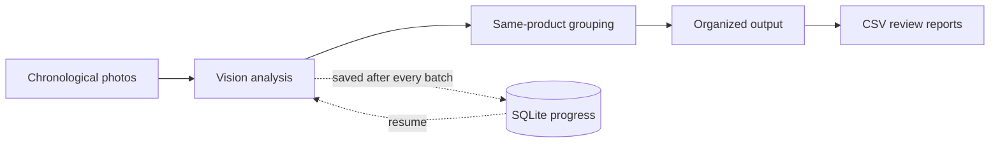
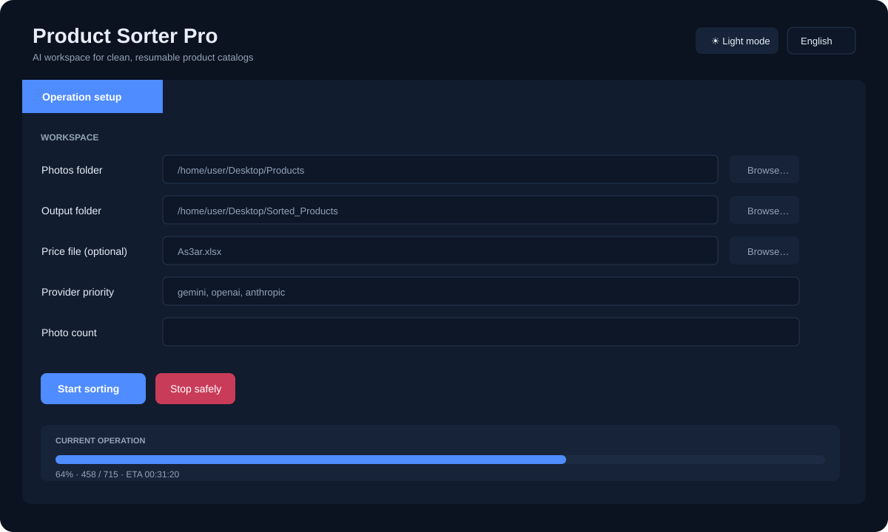
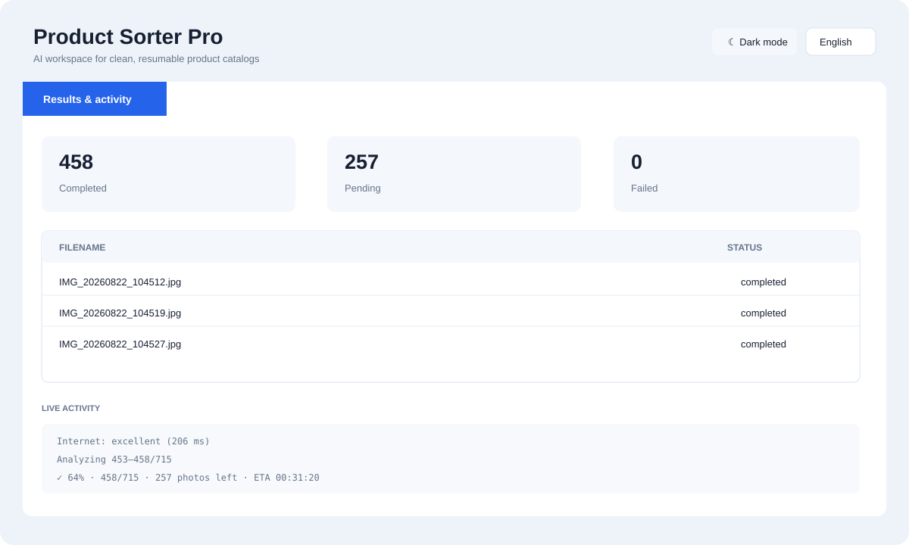

# AI Product Photo Sorter

An open-source desktop workspace and CLI that turns chronological product-shoot
photos into an organized, reviewable catalog—without modifying the originals.

> Current release: **3.1.0-rc1** (release candidate)

## Why it exists

Product shoots often produce a long sequence of front, back, side, and detail photos. This project analyzes that sequence, identifies photos of the same product, and builds an organized output catalog with review and progress reports.

## Highlights

- Shared Tkinter GUI and CLI engine.
- Gemini, OpenAI, and Anthropic support.
- One to four configured API keys per provider (up to 12 total).
- Automatic key rotation on quota/rate-limit errors and optional provider fallback.
- Secure prompt for an extra key when all configured keys are exhausted.
- Resume-safe SQLite progress, run history, backups, and graceful stopping.
- Professional desktop dashboard with operation setup, model/key management,
  live progress, ETA, activity log, and completed/pending/failed counters.
- Instant dark/light appearance switching, saved across launches.
- A single clean terminal progress line, with compact output for GUI/CI capture.
- Internet connectivity and latency-quality checks before API batches.
- Arabic, English, and Chinese interface with device-language detection.
- Optional OS keyring storage for API credentials.
- Windows, Linux, and macOS launchers.

## Safety and privacy

- Source photos are never deleted, moved, or renamed.
- `.env`, databases, output folders, logs, and credentials are ignored by Git.
- Product images are sent to the provider selected by the user. Review that provider's privacy and billing terms before processing sensitive material.
- AI classifications can be wrong. Low-confidence results should be reviewed.

## Quick start

Requires Python 3.10 or newer.

```bash
git clone https://github.com/mhmdwaelanwr/ai-product-photo-sorter.git
cd ai-product-photo-sorter
python -m venv .venv
```

Activate the environment:

```bash
# Linux/macOS
source .venv/bin/activate

# Windows PowerShell
.venv\Scripts\Activate.ps1
```

Install and configure:

```bash
python -m pip install -r requirements.txt
python set_data.py
```

Run the GUI or CLI:

```bash
python product_sorter_gui.py
python product_sorter.py
```

Platform launchers are also available: `start.bat`, `start.command`, and `start.sh`.

## How it works



The engine analyzes overlapping batches so a front photo can stay connected to
the back, side, packaging, and detail photos that follow it. Each successful
batch is committed to SQLite immediately. If the app closes, the internet drops,
or a key reaches quota, reopening the same output folder continues from saved
work rather than starting over.

## Desktop GUI

The GUI and CLI use the same processing engine and progress database. The GUI is
organized into four workspaces:

| Dark mode preview | Light mode preview |
|---|---|
|  |  |

1. **Operation setup** — choose source/output folders, optional price workbook,
   provider priority, and an optional sample size.
2. **Models & API keys** — configure one to four keys per provider and refresh
   the model list shared by those keys.
3. **Results & activity** — follow the current operation, inspect completed,
   pending, and failed counts, read logs, and open the output directory.
4. **About** — project version, developer information, open-source license, and
   direct links to the maintainer's profiles.

Use the sun/moon button in the header to switch between dark and light mode.
The selection is saved automatically in `.env` as `APP_THEME`.

Stopping from the GUI is graceful: the active request finishes, its checkpoint
is saved, and the same operation can be resumed later.

## API configuration

Copy `.env.example` to `.env`, or use `python set_data.py`. You may configure only one key or as many as four per provider:

```dotenv
AI_PROVIDERS=gemini,openai,anthropic
GEMINI_API_KEY_1=your_key
GEMINI_API_KEY_2=
OPENAI_API_KEY_1=your_key
ANTHROPIC_API_KEY_1=your_key
```

Providers are attempted in the listed order. Keys rotate only for quota and rate-limit failures; connectivity and invalid-request errors are handled separately.

The setup wizard checks every configured key and displays only models shared by all of them, so automatic key rotation cannot switch to a key that lacks the selected model. The GUI provides the same selection through a model dropdown and **Refresh models** button. `provider_models.json` is the offline fallback catalog and is refreshed without storing API keys. Completed batches remain cached if the model is changed later.

### Choosing a model

Use **Refresh models** after entering the provider keys. The app queries the
provider and keeps only models available to every configured key. This prevents
processing from failing halfway through when key rotation selects a key without
access to the chosen model. If an old model returns `404 NOT_FOUND`, refresh the
list and choose a current vision-capable model; saved photos will not be repeated.

## Outputs

- Organized product/category folders and `Needs_Review/`.
- `classification_report.csv` and `processing_status.csv`.
- Completed, pending, failed, usage, and run-history reports.
- `progress.sqlite3` for safe resume.

The output folder is the operation identity. Reusing it resumes its saved
progress; choosing a different output folder starts an independent operation.

## Troubleshooting

| Symptom | What to do |
|---|---|
| Model returns `404 NOT_FOUND` | Refresh models and select a currently available vision model. |
| A key reaches quota | The app rotates to the next key; after all keys are exhausted it asks for another. |
| Internet disconnects | Retry after reconnecting; completed batches remain saved. |
| Progress appears paused | The current API request is still running; the count advances after the batch is saved. |
| Large-image Pillow warning | Product photos are still downscaled for requests; inspect unexpected files if the image is untrusted. |

## Tests

```bash
python -m unittest discover -v
python -m py_compile *.py
```

The suite includes a synthetic image-to-report integration flow and key-rotation scenarios. Live checks are opt-in:

```bash
python live_api_smoke.py
python gui_smoke.py
```

See [PRODUCTION_CHECKLIST.md](PRODUCTION_CHECKLIST.md) for checks requiring real credentials, a graphical desktop, or a labeled product dataset.

## العربية

الأداة ترتب صور جلسات تصوير المنتجات، وتجمع صور الواجهة والخلفية والجوانب
والتفاصيل للمنتج نفسه، وتحفظ كل دفعة للاستكمال الآمن. الواجهة الرسومية تعرض
إعداد العملية والموديلات والمفاتيح والنتائج في أقسام واضحة، وتدعم العربية
والإنجليزية والصينية. يمكن استخدام مفتاح واحد أو حتى أربعة مفاتيح لكل مزود.
ابدأ بتشغيل `python set_data.py` لإعداد المشروع دون تعديل الملفات يدويًا.

## Contributing and security

Read [CONTRIBUTING.md](CONTRIBUTING.md) before opening a pull request. Report vulnerabilities according to [SECURITY.md](SECURITY.md). Never include API keys or private product images in an issue.

## Developer

Developed and maintained by **Mohamed Anwar**.

- [GitHub](https://github.com/mhmdwaelanwr)
- [LinkedIn](https://linkedin.com/in/mhmdwaelanwr)
- [X (Twitter)](https://x.com/mhmdwaelanwr)
- [Facebook](https://facebook.com/mhmdwaelanwr)
- [Instagram](https://instagram.com/mhmdwaelanwr)
- [Telegram DM](https://t.me/Mhmdwaelanwer)

## License

MIT — see [LICENSE](LICENSE).
