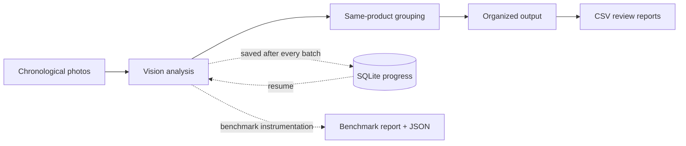

<div align="center">


# AI Product Photo Sorter

### Turn chronological product-shoot photos into an organized, reviewable catalog.

Desktop GUI + CLI · Multi-provider vision · Safe resume · Automatic key rotation · Reproducible benchmarks

[](https://github.com/mhmdwaelanwr/ai-product-photo-sorter/actions/workflows/tests.yml)
[](https://www.python.org/)
[](https://github.com/mhmdwaelanwr/ai-product-photo-sorter/releases/latest)
[](https://pypi.org/project/ai-product-photo-sorter/)
[](https://github.com/mhmdwaelanwr/ai-product-photo-sorter/blob/main/LICENSE)
[](#installation)

[](https://github.com/mhmdwaelanwr/ai-product-photo-sorter/releases/latest/download/ProductSorterPro-windows-x64.zip)
[](https://github.com/mhmdwaelanwr/ai-product-photo-sorter/releases/latest/download/product-sorter-pro_3.1.1_all.deb)
[](https://github.com/mhmdwaelanwr/ai-product-photo-sorter/releases/latest/download/ProductSorterPro-macos-arm64.zip)
[](https://github.com/mhmdwaelanwr/ai-product-photo-sorter/releases/latest/download/ProductSorterPro-macos-x64.zip)

[Features](#features) · [Demo](#quick-demo) · [Installation](#installation) · [Benchmark](BENCHMARK.md) · [Configuration](#api-configuration) · [Roadmap](ROADMAP.md) · [Limitations](KNOWN_LIMITATIONS.md) · [All releases](https://github.com/mhmdwaelanwr/ai-product-photo-sorter/releases)

</div>


AI Product Photo Sorter analyzes a continuous photo-shoot sequence, recognizes
which front, back, side, packaging, and detail shots belong to the same product,
then creates an organized catalog without moving, renaming, or deleting the
source files.

The stable `v3.1.1` release is available both as ready-to-run desktop builds on
[GitHub Releases](https://github.com/mhmdwaelanwr/ai-product-photo-sorter/releases/tag/v3.1.1)
and as a Python package on [PyPI](https://pypi.org/project/ai-product-photo-sorter/).

> **Development note:** Benchmark Center belongs to the current 3.2 development
> line. Until a 3.2 release is published, the stable `v3.1.1` desktop/PyPI builds
> do not contain this feature; build from the current source branch to test it.

## Quick demo


The demo is generated from the real application screenshots in this repository:
operation setup → API-key configuration → results → generated output → dark mode.
Run `python scripts/build_demo_gif.py` after changing those screenshots; CI verifies
that the committed GIF remains synchronized.

## Features

| Capability | What it provides |
|---|---|
| **Multi-provider vision** | Gemini, OpenAI, and Anthropic with ordered fallback. |
| **Key pools** | One to four keys per provider—up to 12 configured keys—with automatic quota/rate-limit rotation. |
| **Live model discovery** | Provider model catalogs refreshed from configured credentials; multi-key pools expose only shared models. |
| **Crash-safe resume** | Successful batches are committed to SQLite immediately and can be resumed from the same output folder. |
| **Professional GUI + CLI** | One shared engine, live status, ETA, completed/pending/failed views, logs, and graceful stopping. |
| **Benchmark Center** | Fresh isolated real-pipeline runs with provider/model timing, throughput, image-encoding metrics, token/cost totals, hardware snapshots, JSON history, Markdown reports, and optional ground-truth accuracy. |
| **Smart report** | Optional operation-wide Markdown summary built from deterministic catalog facts plus one final advisory text-only AI analysis. |
| **Dark and light themes** | Instant persistent appearance switching from the desktop header. |
| **Multilingual UI** | Arabic, English, and Chinese with device-language detection. |
| **Quality controls** | Confidence review folders, CSV reports, usage tracking, internet/latency checks, failure exports, and labeled-dataset scoring. |
| **Cross-platform delivery** | CI-built Windows x64 executable, Linux x64 binary/DEB, native macOS Apple Silicon and Intel app bundles, plus PyPI wheel/source distributions. |

## Benchmark Center

Benchmark mode measures the **same production sorting path** used by a normal
operation. It does not replace the classifier with a synthetic test and it does
not reuse an existing operation cache.

```bash
product-sorter \
  --source ./Products \
  --output ./Sorted_Products \
  --limit 100 \
  --benchmark
```

Every run gets a fresh output directory under `Sorted_Products/benchmarks/` and
produces both human-readable and machine-readable evidence:

```text
Sorted_Products/
└── benchmarks/
    ├── history.jsonl
    ├── latest.txt
    └── run_YYYYMMDD_HHMMSS_microseconds/
        ├── BENCHMARK_REPORT.md
        ├── benchmark.json
        ├── processing_status.csv
        ├── api_usage.csv
        ├── progress.sqlite3
        └── normal sorter outputs
```

A benchmark records wall time, average time per completed photo, throughput,
provider/model timing, logical provider calls, failures, image compression time,
encoded payload size, token usage, configured cost estimates, process memory,
platform/CPU information, and NVIDIA GPU information when `nvidia-smi` is
available. Add `--ground-truth expected.csv` to include measured classification
accuracy.

Smart Markdown reporting is disabled automatically during benchmark mode so its
optional extra AI narrative request cannot distort the benchmark timing or token
totals. Provider-internal retry delays remain part of elapsed time, while the
report labels its request counter as **logical provider calls** rather than
pretending every internal retry is individually observable.

For methodology, fair model comparisons, cloud/local caveats, and the verified
results table, see **[BENCHMARK.md](BENCHMARK.md)**. The repository intentionally
does not publish guessed performance numbers.

## Brand assets

The official Smart Photo Stack identity is available in production-ready forms:

- Transparent and themed PNG artwork from `16×16` through `1024×1024`.
- Scalable SVG source plus a simplified small-size SVG.
- Multi-resolution Windows `.ico` and macOS `.icns` application icons.
- Dedicated dark and light presentation variants.

All official files live in [`assets/branding`](assets/branding).

## Safety by design

- Originals are never deleted, moved, renamed, or overwritten.
- `.env`, credentials, runtime databases, output folders, and logs are excluded from Git.
- API keys remain masked in the GUI and can optionally be stored in the OS keyring.
- Product images are sent only to the selected provider; review its privacy and billing terms before processing sensitive material.
- AI output is probabilistic. Low-confidence classifications are separated for human review.
- Benchmark mode uses a fresh operation directory so cached responses cannot make a result look artificially fast.

## Installation

### Install from PyPI

For Python 3.10 or newer, install the published stable package directly from PyPI:

```bash
python -m pip install --upgrade ai-product-photo-sorter
```

Verify the installed version:

```bash
product-sorter --version
```

Available commands after installation:

```bash
product-sorter          # CLI
product-sorter-gui      # desktop GUI
product-sorter-setup    # guided API/configuration setup
```

Package page: [pypi.org/project/ai-product-photo-sorter](https://pypi.org/project/ai-product-photo-sorter/)

### Ready-to-run desktop builds

The recommended path for normal desktop use is the latest GitHub Release. Every
stable release is built by GitHub Actions for Windows x64, Linux x64, macOS Apple
Silicon, and macOS Intel before its assets are published.

| Platform | Download | Start |
|---|---|---|
| **Windows x64** | [`ProductSorterPro-windows-x64.zip`](https://github.com/mhmdwaelanwr/ai-product-photo-sorter/releases/latest/download/ProductSorterPro-windows-x64.zip) or the standalone [`ProductSorterPro.exe`](https://github.com/mhmdwaelanwr/ai-product-photo-sorter/releases/latest/download/ProductSorterPro.exe) | Extract the ZIP and run `ProductSorterPro.exe`. |
| **Linux x64 (Debian/Ubuntu)** | [`product-sorter-pro_3.1.1_all.deb`](https://github.com/mhmdwaelanwr/ai-product-photo-sorter/releases/latest/download/product-sorter-pro_3.1.1_all.deb) | `sudo apt install ./product-sorter-pro_3.1.1_all.deb` |
| **Linux x64 (standalone)** | [`ProductSorterPro-linux-x64.tar.gz`](https://github.com/mhmdwaelanwr/ai-product-photo-sorter/releases/latest/download/ProductSorterPro-linux-x64.tar.gz) | Extract it and run `ProductSorterPro`. |
| **macOS Apple Silicon** | [`ProductSorterPro-macos-arm64.zip`](https://github.com/mhmdwaelanwr/ai-product-photo-sorter/releases/latest/download/ProductSorterPro-macos-arm64.zip) | Extract it and open `ProductSorterPro.app`. |
| **macOS Intel** | [`ProductSorterPro-macos-x64.zip`](https://github.com/mhmdwaelanwr/ai-product-photo-sorter/releases/latest/download/ProductSorterPro-macos-x64.zip) | Extract it and open `ProductSorterPro.app`. |

Release assets also include the Python wheel, source archive, and
`SHA256SUMS.txt` for integrity checking.

> **Signing note:** v3.1.1 desktop binaries are not code-signed or Apple-notarized yet, so Windows SmartScreen or macOS Gatekeeper may show a first-launch warning. See [Known Limitations](KNOWN_LIMITATIONS.md) before production deployment.

You still need an API key for at least one supported cloud vision provider.
Configure it from the GUI or with the setup wizard after installation.

### Build from source

Requires Python 3.10 or newer.

```bash
git clone https://github.com/mhmdwaelanwr/ai-product-photo-sorter.git
cd ai-product-photo-sorter
python -m venv .venv
```

Activate the environment:

```bash
# Linux/macOS
source .venv/bin/activate

# Windows PowerShell
.venv\Scripts\Activate.ps1
```

Install and configure:

```bash
python -m pip install -r requirements.txt
python set_data.py
```

Run the GUI or CLI:

```bash
python product_sorter_gui.py
python product_sorter.py
```

Platform launchers are also available: `start.bat`, `start.command`, and `start.sh`.

## How it works



The engine analyzes overlapping batches so a front photo can stay connected to
the back, side, packaging, and detail photos that follow it. Each successful
batch is committed to SQLite immediately. If the app closes, the internet drops,
or a key reaches quota, reopening the same output folder continues from saved
work rather than starting over.

Benchmark instrumentation wraps that shared engine rather than maintaining a
second classifier implementation. This keeps performance measurements tied to
the code path users actually run.

## Desktop GUI

The GUI and CLI use the same processing engine and progress database. The current
development GUI is organized into **seven workspaces** and supports persistent
light and dark themes.

### Operation workspace

| Main setup | Native folder selection |
|---|---|
|  |  |
| The operation dashboard keeps the photo source, output destination, optional Excel price catalog, provider priority, sample size, actions, and progress in one focused screen. | Native system dialogs make selecting source and output directories familiar and reduce path-entry mistakes. |

| Inspecting generated files | Dark operation workspace |
|---|---|
|  |  |
| **Open output** takes the user directly to the organized folders, CSV reports, progress database, usage data, and run history produced by the current operation. | The same complete workflow in the low-glare dark palette. The selected theme is saved and restored on the next launch. |

### Providers, keys, and live model discovery

| Gemini key pool | Gemini model menu |
|---|---|
|  |  |
| Four masked Gemini key slots form one rotation pool. The selected vision model is shared by the pool so quota switching remains safe. | The model selector uses the refreshed provider catalog while still allowing the user to inspect and change the active model. |

| Anthropic model menu | Dark provider workspace |
|---|---|
|  |  |
| Provider-specific catalogs keep Anthropic choices separate from Gemini and OpenAI while preserving the same four-key workflow. | API configuration remains readable in dark mode, with masked credentials, consistent spacing, and a dedicated model refresh action. |

| Shared-model verification | Full live catalog |
|---|---|
|  |  |
| After refresh, the GUI confirms how many models are shared by the configured keys. This prevents rotation to a key that cannot access the chosen model. | The live dropdown exposes the provider's currently available models instead of relying only on a hard-coded list—important when models are added or retired. |

### Results and activity

| Completed | Pending |
|---|---|
|  |  |
| Completed photos are listed by filename with a clear status, while the summary cards show operation totals at a glance. | The pending view makes the remaining workload explicit and stays synchronized with the persistent processing report. |

| Failed requests | Dark diagnostics |
|---|---|
|  |  |
| Errors retain their affected filenames and provider message for troubleshooting. The live activity panel preserves internet checks, batches, rotation events, and safe-stop messages. | Dark diagnostics provide the same failure detail and operational log without sacrificing contrast during long processing sessions. |

### Benchmark workspace

The Benchmark workspace deliberately reuses the normal source/output settings,
provider priority, selected model, and configured API credentials. Choose a photo
count, start the benchmark, and open the latest generated report from the same
application. Normal sorting remains the default; benchmark mode is opt-in.

The generated report lives in a fresh benchmark run directory, so an existing
`progress.sqlite3` from a production operation cannot turn a cached resume into a
misleading speed result.

### About and open source

| Light About workspace | Dark About workspace |
|---|---|
|  |  |
| The About page identifies the application version, developer and maintainer, MIT license, social profiles, and one-click contact copying. | The open-source identity and developer links remain a first-class part of the application in both themes. |

1. **Operation setup** — choose source/output folders, optional price workbook,
   provider priority, and an optional sample size.
2. **Models & API keys** — configure one to four keys per provider and refresh
   the model list shared by those keys.
3. **Results & activity** — follow the current operation, inspect completed,
   pending, and failed counts, read logs, and open the output directory.
4. **Benchmark Center** — run isolated real-pipeline measurements and open the
   generated Markdown benchmark report.
5. **About** — project version, developer information, open-source license, and
   direct links to the maintainer's profiles.

Use the sun/moon button in the header to switch between dark and light mode.
The selection is saved automatically in `.env` as `APP_THEME`.

Stopping from the GUI is graceful: the active request finishes, its checkpoint
is saved, and the same operation can be resumed later.

## API configuration

Copy `.env.example` to `.env`, or use `python set_data.py`. You may configure only one key or as many as four per provider:

```dotenv
AI_PROVIDERS=gemini,openai,anthropic
GEMINI_API_KEY_1=your_key
GEMINI_API_KEY_2=
OPENAI_API_KEY_1=your_key
ANTHROPIC_API_KEY_1=your_key
```

Providers are attempted in the listed order. Keys rotate only for quota and rate-limit failures; connectivity and invalid-request errors are handled separately.

The setup wizard checks every configured key and displays only models shared by all of them, so automatic key rotation cannot switch to a key that lacks the selected model. The GUI provides the same selection through a model dropdown and **Refresh models** button. `provider_models.json` is the offline fallback catalog and is refreshed without storing API keys. Completed batches remain cached if the model is changed later.

### Choosing a model

Use **Refresh models** after entering the provider keys. The app queries the
provider and keeps only models available to every configured key. This prevents
processing from failing halfway through when key rotation selects a key without
access to the chosen model. If an old model returns `404 NOT_FOUND`, refresh the
list and choose a current vision-capable model; saved photos will not be repeated.

### Local models and Ollama

The current runtime supports Gemini plus OpenAI and Anthropic provider pools.
An optional local vision-model adapter is tracked separately on the 4.0 roadmap;
Benchmark Center is intentionally provider-agnostic so that adapter can reuse the
same measurement/reporting layer when it is implemented. The README does not
claim Ollama/Gemma support before that runtime adapter exists.

## Outputs

Normal operation:

```text
Sorted_Products/
├── <category>/<product>/       # organized product views
├── Needs_Review/               # low-confidence classifications
├── classification_report.csv  # final AI classification report
├── processing_status.csv       # completed and pending photos
├── completed_files.txt
├── pending_files.txt
├── error_report.csv
├── api_usage.csv
├── run_history.log
└── progress.sqlite3            # resumable operation state
```

Benchmark operation adds its own isolated `benchmarks/run_*` tree as documented
in [BENCHMARK.md](BENCHMARK.md).

The normal output folder is the operation identity. Reusing it resumes its saved
progress; choosing a different output folder starts an independent operation.

## Troubleshooting

| Symptom | What to do |
|---|---|
| Model returns `404 NOT_FOUND` | Refresh models and select a currently available vision model. |
| A key reaches quota | The app rotates to the next key; after all keys are exhausted it asks for another. |
| Internet disconnects | Retry after reconnecting; completed batches remain saved. |
| Progress appears paused | The current API request is still running; the count advances after the batch is saved. |
| Benchmark is unexpectedly fast | Confirm you used `--benchmark`; benchmark mode creates a fresh isolated run specifically to avoid cached-batch timing. |
| Large-image Pillow warning | Product photos are still downscaled for requests; inspect unexpected files if the image is untrusted. |

## Tests

```bash
python -m unittest discover -s tests -t . -v
python -m compileall -q src product_sorter.py product_sorter_gui.py set_data.py scripts
```

The suite includes synthetic image-to-report integration, key-rotation scenarios,
release-metadata consistency, package-layout checks, and Benchmark Center report
coverage. The CI matrix runs on Linux, Windows, and macOS with Python 3.10 and
3.12. Live-provider checks remain opt-in so CI does not require user credentials.

See [PRODUCTION_CHECKLIST.md](PRODUCTION_CHECKLIST.md) for checks requiring real
credentials, a graphical desktop, or a labeled product dataset.

## Architecture

The canonical runtime lives under `src/ai_product_photo_sorter/`. Public
`core.py` and `gui.py` facades preserve the stable v3.1 surface while applying
small extension modules around the compatibility-preserved engine. Benchmark
instrumentation follows that same pattern instead of expanding `_core_impl.py`
with a second processing implementation.

```text
src/ai_product_photo_sorter/
├── core.py                 # public core facade
├── _core_impl.py           # compatibility-preserved processing engine
├── gui.py                  # public GUI facade
├── _gui_impl.py            # compatibility-preserved Tkinter implementation
├── benchmark.py            # benchmark instrumentation/reporting
├── benchmark_gui.py        # Benchmark workspace extension
├── smart_report.py
├── dynamic_taxonomy.py
├── hardening.py
├── providers.py
└── ...
```

## Contributing and security

Read [CONTRIBUTING.md](CONTRIBUTING.md) before opening a pull request. Report
vulnerabilities according to [SECURITY.md](SECURITY.md). Never include API keys
or private product images in an issue.

Before planning production use, review the [roadmap](ROADMAP.md), [known
limitations](KNOWN_LIMITATIONS.md), [benchmark methodology](BENCHMARK.md), and
[production checklist](PRODUCTION_CHECKLIST.md).

## Developer

<div align="center">

**Mohamed Anwar**  
Developer & Maintainer of **AI Product Photo Sorter**

<br>

<a href="https://github.com/mhmdwaelanwr"></a>
<a href="https://linkedin.com/in/mhmdwaelanwr"></a>
<a href="https://x.com/mhmdwaelanwr"></a>

<br>

<a href="https://facebook.com/mhmdwaelanwr"></a>
<a href="https://instagram.com/mhmdwaelanwr"></a>
<a href="https://t.me/Mhmdwaelanwer"></a>

</div>

## License

<div align="center">

[](LICENSE)

Released under the **MIT License**. See [LICENSE](LICENSE) for details.

</div>
